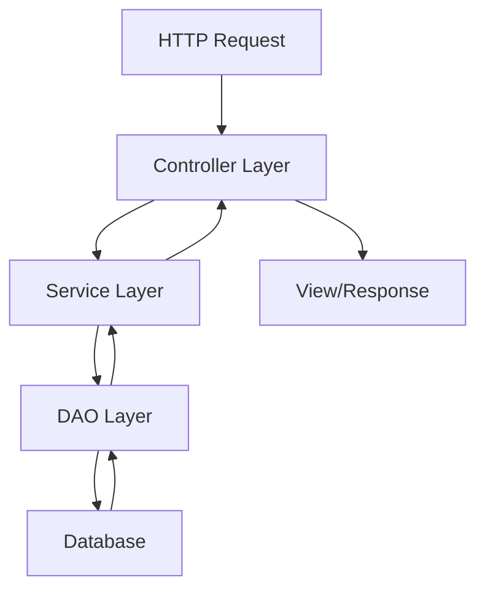
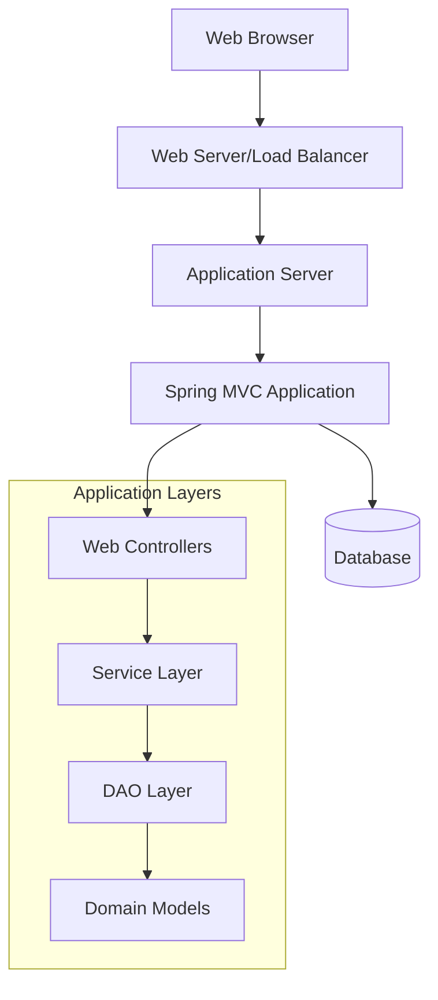

# context

## System Overview
The ECommerce repository is a comprehensive Java-based e-commerce web application built using the Spring MVC framework. This system provides a complete online shopping platform with distinct interfaces for customers and administrators.

### Core Purpose

The application serves as a full-featured e-commerce solution that enables:
- **Customer Experience**: Product browsing, shopping cart management, wishlist functionality, and user account management
- **Administrative Control**: Complete backend management of products, categories, suppliers, and users
- **Secure Operations**: Role-based authentication and authorization with support for multiple user types (DBA, Admin, User)

### Key Functional Areas

**Customer-Facing Features:**
- Product catalog with category-based browsing and search capabilities
- Shopping cart system for item management and checkout processes
- Personal wishlist functionality for saving desired products
- User account management including registration, login, and profile editing
- Order processing and tracking system

**Administrative Features:**
- Comprehensive admin dashboard for system oversight
- Category management with full CRUD operations
- Product management including inventory and supplier relationships
- User management with status control and account administration
- Supplier management for vendor relationships

**Technical Foundation:**
- Spring MVC architecture with layered design (Controller-Service-DAO-Model)
- Hibernate ORM for database operations and entity management
- Spring Security for authentication and role-based access control
- RESTful API endpoints for both user and administrative operations

The system follows enterprise-grade architectural patterns including the MVC pattern, DAO pattern, and Service Layer pattern, ensuring maintainable and scalable code organization. The application supports multiple user roles with customized authentication flows and provides a robust foundation for e-commerce operations.

## Domain Model
The ECommerce application is built around several core domain entities that represent the business concepts and their relationships:

### Core Entities

#### User Management
- **User**: Central entity representing system users with email, mobile, role, and active status properties. Users can have different roles (DBA, Admin, User) and maintain relationships with cart and wishlist entities
- **Roles**: Defines user permission levels within the system
- **ShippingDetails**: Manages delivery address information for orders

#### Product Catalog
- **Product**: Core business entity containing price, image, description, discount information, and relationships to categories and suppliers
- **Category**: Organizes products into logical groupings with name and description properties
- **Supplier**: Represents product suppliers and maintains supply chain relationships

#### Shopping Experience
- **Cart**: Shopping cart entity with quantity, total, user association, and status tracking
- **Wishlist**: User's saved items for future consideration
- **CustomerOrder**: Order entity managing payment mode, grand total, status, and address information

### Entity Relationships

The domain model follows these key relationships:

- **Product-Category**: Products belong to categories (many-to-one)
- **Product-Supplier**: Products are supplied by suppliers (many-to-one)
- **User-Cart**: Users own shopping carts (one-to-many)
- **User-Wishlist**: Users maintain wishlists (one-to-many)
- **User-Order**: Users place orders (one-to-many)

### Business Rules

- Users must be authenticated to access cart and wishlist functionality
- Products must be associated with both a category and supplier
- Cart items maintain quantity and total calculations
- Orders track payment methods and shipping details
- Role-based access controls determine user permissions (Admin, DBA, User)

### Domain Services

The application implements service interfaces for each major domain area:
- **UserService**: User account management and authentication
- **ProductService**: Product catalog operations
- **CategoryService**: Category management
- **SupplierService**: Supplier relationship management
- **MailService**: Communication and notification services

These services encapsulate business logic and coordinate between the web layer and data access layer, ensuring proper separation of concerns and maintainable domain operations.

## API Inventory
The ECommerce application exposes a comprehensive REST API organized into functional modules. Below is the complete inventory of available endpoints:

### Public Endpoints

| Method | Path | Purpose |
|--------|------|----------|
| GET | `/` | Home page display |
| GET | `/aboutUs` | About us page |
| GET | `/contactUs` | Contact information page |
| GET | `/login` | User login page |
| GET | `/logout` | User logout handler |
| GET | `/Registration` | User registration page |
| GET | `/register` | User registration handler |
| GET | `/Access_Denied` | Access denied error page |

### Product & Catalog Endpoints

| Method | Path | Purpose |
|--------|------|----------|
| GET | `/displayProduct/productsList` | Display all products |
| GET | `/displayProduct/productList/categorywise/{category_id}` | Display products by category |
| GET | `/descriptionPage` | Product description page |
| GET | `/SearchController` | Product search functionality |

### User Account Management

| Method | Path | Purpose |
|--------|------|----------|
| GET | `/account` | User account overview |
| GET | `/user/{username}/account` | User-specific account page |
| GET | `/user/{username}/account/edit-details/{user_id}` | Account edit form |
| POST | `/updatingAccount-{id}` | Update account details |
| POST | `/user/{username}/account/edit-details/updatingAccount/{user_id}` | Update user account details |

### Shopping Cart Operations

| Method | Path | Purpose |
|--------|------|----------|
| GET | `/addCart` | Add item to cart |
| GET | `/{username}/cart` | View user's shopping cart |
| GET | `/{username}/cart/remove-cart/{cart_id}` | Remove item from cart |
| GET | `/customerOrder` | Customer order processing |

### Wishlist Management

| Method | Path | Purpose |
|--------|------|----------|
| GET | `/user/addWishlistItem` | Add item to wishlist |
| GET | `/user/{username}/wishlist` | View user's wishlist |
| GET | `/user/{username}/wishlist/remove-wishlist/{wishlist_id}` | Remove item from wishlist |

### Admin Dashboard

| Method | Path | Purpose |
|--------|------|----------|
| GET | `/admin/dashboard` | Admin dashboard home |
| GET | `/gotoadminsection` | Navigate to admin section |
| GET | `/db` | Database administration |

### Admin - Category Management

| Method | Path | Purpose |
|--------|------|----------|
| GET | `/admin/categorys/category` | Category management page |
| POST | `/admin/categorys/add` | Add new category |
| GET | `/admin/categorys/edit/{category_id}` | Edit category form |
| POST | `/admin/categorys/edit/{category_id}` | Update category |
| GET | `/admin/categorys/delete/{category_id}` | Delete category |

### Admin - Product Management

| Method | Path | Purpose |
|--------|------|----------|
| GET | `/admin/products/product` | Product management page |
| GET | `/admin/products/edit/{product_id}` | Edit product form |
| GET | `/admin/products/delete/{product_id}` | Delete product |

### Admin - Supplier Management

| Method | Path | Purpose |
|--------|------|----------|
| GET | `/admin/suppliers/supplier` | Supplier management page |
| GET | `/admin/suppliers/edit/{supplier_id}` | Edit supplier form |
| GET | `/admin/suppliers/delete/{supplier_id}` | Delete supplier |

### Admin - User Management

| Method | Path | Purpose |
|--------|------|----------|
| GET | `/admin/users/user` | User management page |
| GET | `/admin/users/changeStatus/{id}` | Change user status |
| GET | `/admin/users/delete/{id}` | Delete user account |

### API Architecture Notes

- **Authentication**: Role-based access control with DBA, Admin, and User roles
- **Response Format**: Primarily returns view names for MVC rendering
- **Path Parameters**: Used extensively for entity identification (IDs, usernames)
- **HTTP Methods**: Follows RESTful conventions with GET for retrieval and POST for modifications
- **Security**: Admin endpoints require appropriate role authorization

## Data Flows
The ECommerce application follows a layered architecture with well-defined data flows between components:

### Request Processing Flow

### Authentication Flow

1. **User Login Request**
   - `GET /login` → Login page display
   - User credentials submitted
   - SecurityConfiguration processes authentication
   - CustomSuccessHandler manages post-login routing

2. **User Registration Flow**
   - `GET /register` → Registration page
   - `GET /Registration` → Registration form
   - User data validation and account creation

### Admin Management Flows

**Category Management:**
- `GET /admin/dashboard` → Admin dashboard
- `GET /admin/categorys/category` → Category listing
- `POST /admin/categorys/add` → Create new category
- `GET /admin/categorys/edit/{category_id}` → Edit category form
- `POST /admin/categorys/edit/{category_id}` → Update category
- `GET /admin/categorys/delete/{category_id}` → Delete category

**Product Management:**
- `GET /admin/products/product` → Product listing
- `POST /admin/products/add` → Create new product
- `GET /admin/products/edit/{product_id}` → Edit product form
- `POST /admin/products/edit/{product_id}` → Update product
- `GET /admin/products/delete/{product_id}` → Delete product

**User Management:**
- `GET /admin/users/user` → User listing
- `GET /admin/users/changeStatus/{id}` → Toggle user status
- `GET /admin/users/delete/{id}` → Delete user

### Customer Shopping Flows

**Cart Operations:**
- `GET /addCart` → Add item to cart
- `GET /{username}/cart` → View user's cart
- `GET /{username}/cart/remove-cart/{cart_id}` → Remove from cart

**Wishlist Operations:**
- `GET /user/addWishlistItem` → Add to wishlist
- `GET /user/{username}/wishlist` → View user's wishlist
- `GET /user/{username}/wishlist/remove-wishlist/{wishlist_id}` → Remove from wishlist

**Account Management:**
- `GET /user/{username}/account` → View account details
- `GET /user/{username}/account/edit-details/{user_id}` → Edit account form
- `POST /user/{username}/account/edit-details/updatingAccount/{user_id}` → Update account
- `POST /updatingAccount-{id}` → Alternative account update endpoint

### Product Discovery Flow

- `GET /` → Home page with featured products
- `GET /displayProduct/productsList` → All products listing
- `GET /displayProduct/productList/categorywise/{category_id}` → Category-filtered products
- `GET /SearchController` → Product search functionality
- `GET /descriptionPage` → Product detail view

### Data Layer Interactions

Each business operation follows the pattern:
1. **Controller** receives HTTP request
2. **Service Layer** implements business logic
3. **DAO Layer** handles data persistence
4. **Model Classes** represent domain entities

Key entity relationships:
- Products belong to Categories and are supplied by Suppliers
- Carts and Wishlists belong to Users
- All operations maintain referential integrity through proper DAO implementations

## External Integrations
The ECommerce application integrates with several external systems and services to provide comprehensive functionality:

### Database Integration

The application uses a layered data access architecture with DAO (Data Access Object) pattern implementations:

- **Category Data Access**: `CategoryDaoImpl` implements `CategoryDao` for category management operations
- **Product Data Access**: `ProductDaoImpl` implements `ProductDao` for product catalog operations  
- **User Data Access**: `UserDaoImpl` implements `UserDao` for user account management
- **Cart Data Access**: `CartDaoImpl` implements `CartDao` for shopping cart persistence
- **Supplier Data Access**: `SupplierDaoImpl` implements `SupplierDao` for supplier information management

### Email Services

The system includes email functionality through:

- **Mail Service**: `MailServiceImpl` implements `MailService` interface for email notifications and communications
- **Contact Integration**: Contact us functionality (`/contactUs`) for customer inquiries

### Authentication & Security

- **Custom Authentication**: `SecurityConfiguration` uses `CustomSuccessHandler` for specialized authentication flows
- **Session Management**: User session handling for cart and wishlist persistence
- **Access Control**: Role-based access with admin dashboard restrictions

### Third-Party Service Endpoints

The application exposes integration points for:

- **Database Administration**: `/db` endpoint for database management tools
- **External Search**: Search functionality through `SearchController` for product discovery
- **Order Processing**: Customer order integration via `/customerOrder` endpoint

### Service Layer Architecture

Business logic is abstracted through service interfaces:

- **Category Services**: `CategoryServiceImpl` implements `CategoryService`
- **Product Services**: `ProductServiceImpl` implements `ProductService`  
- **User Services**: `UserServiceImpl` implements `UserService`
- **Supplier Services**: `SupplierServiceImpl` implements `SupplierService`

core business logic

## User Journeys
### Customer Journey

#### Product Discovery & Shopping
1. **Browse Products**: Customers visit the home page (`/`) and can view all products (`/displayProduct/productsList`) or filter by category (`/displayProduct/productList/categorywise/{category_id}`)
2. **Product Details**: View detailed product information on the description page (`/descriptionPage`)
3. **Add to Cart**: Add desired items to shopping cart (`/addCart`) and manage cart contents (`/{username}/cart`)
4. **Wishlist Management**: Save items for later (`/user/addWishlistItem`) and manage wishlist (`/user/{username}/wishlist`)
5. **Account Management**: Register (`/register`), login (`/login`), and manage account details (`/user/{username}/account`)
6. **Order Placement**: Complete purchases through the customer order flow (`/customerOrder`)

#### Authentication Flow
- **Registration**: New users register via `/Registration` endpoint
- **Login**: Users authenticate through `/login` with role-based redirection handled by `CustomSuccessHandler`
- **Role-based Access**: System redirects users to appropriate sections (DBA, Admin, User) based on their role

### Administrator Journey

#### Admin Dashboard Access
1. **Login**: Administrators authenticate and are redirected to admin dashboard (`/admin/dashboard`)
2. **Navigation**: Access admin section via `/gotoadminsection`

#### Content Management
1. **Category Management**:
   - View categories (`/admin/categorys/category`)
   - Add new categories (`POST /admin/categorys/add`)
   - Edit existing categories (`/admin/categorys/edit/{category_id}`)
   - Delete categories (`/admin/categorys/delete/{category_id}`)

2. **Product Management**:
   - View products (`/admin/products/product`)
   - Edit product details (`/admin/products/edit/{product_id}`)
   - Delete products (`/admin/products/delete/{product_id}`)

3. **Supplier Management**:
   - View suppliers (`/admin/suppliers/supplier`)
   - Edit supplier information (`/admin/suppliers/edit/{supplier_id}`)
   - Delete suppliers (`/admin/suppliers/delete/{supplier_id}`)

4. **User Management**:
   - View all users (`/admin/users/user`)
   - Change user status (`/admin/users/changeStatus/{id}`)
   - Delete users (`/admin/users/delete/{id}`)

### Developer Journey

#### Application Setup
1. **Configuration**: Set up Spring MVC configuration via `HelloWorldConfiguration`
2. **Security Setup**: Configure authentication and authorization through `SecurityConfiguration`
3. **Database Setup**: Configure Hibernate ORM and data source via `HibernateConfiguration`
4. **Web Flow**: Set up application flow using `WebFlowConfig`

#### Development Workflow
1. **Controller Development**: Implement MVC controllers for different functional areas:
   - `CartController` for shopping cart operations
   - `ProductController` for product display and search
   - `UserAccountController` for account management
   - `WishlistController` for wishlist functionality
   - Admin controllers for backend management

2. **Service Layer**: Implement business logic through service interfaces and implementations:
   - `CategoryService`/`CategoryServiceImpl`
   - `ProductService`/`ProductServiceImpl`
   - `UserService`/`UserServiceImpl`
   - `SupplierService`/`SupplierServiceImpl`

3. **Data Access**: Implement data persistence through DAO pattern:
   - `CategoryDao`/`CategoryDaoImpl`
   - `ProductDao`/`ProductDaoImpl`
   - `UserDao`/`UserDaoImpl`
   - `CartDao`/`CartDaoImpl`

4. **Model Development**: Define domain entities:
   - `User` with email, mobile, role, and relationships
   - `Product` with price, description, category, and supplier relationships
   - `Cart` with quantity, total, and user associations
   - `Category` with name, description, and product relationships
   - `CustomerOrder` with payment and shipping details

### Common User Flows

#### Shopping Cart Flow
1. Browse products → Add to cart (`/addCart`) → View cart (`/{username}/cart`) → Remove items if needed (`/{username}/cart/remove-cart/{cart_id}`) → Proceed to checkout

#### Wishlist Flow
1. Browse products → Add to wishlist (`/user/addWishlistItem`) → View wishlist (`/user/{username}/wishlist`) → Remove items (`/user/{username}/wishlist/remove-wishlist/{wishlist_id}`) → Move to cart

#### Account Management Flow
1. Register (`/register`) → Login (`/login`) → Access account (`/user/{username}/account`) → Edit details → Update account (`POST /user/{username}/account/edit-details/updatingAccount/{user_id}`)

## Deployment Notes
Based on the Spring MVC architecture, this application follows a typical Java web application deployment pattern:

### Runtime Environment
- **Application Server**: Requires Java servlet container (Tomcat, Jetty, or similar)
- **Framework Stack**: Spring Framework with Hibernate ORM integration
- **Security Layer**: Spring Security for authentication and authorization
- **Web Flow**: Spring Web Flow for complex page navigation

### Deployment Topology

### Component Distribution
- **Web Layer**: Controllers handle HTTP requests and responses
- **Business Layer**: Services contain business logic and transaction management
- **Data Layer**: DAOs manage database interactions through Hibernate
- **Domain Layer**: Model classes represent business entities

### Runtime Dependencies
- Spring Framework core modules
- Hibernate ORM for database persistence
- Spring Security for authentication/authorization
- Spring Web Flow for stateful web interactions
- Database connectivity (JDBC drivers)

*Note: Specific deployment configuration details are not available in the current codebase documentation.*
