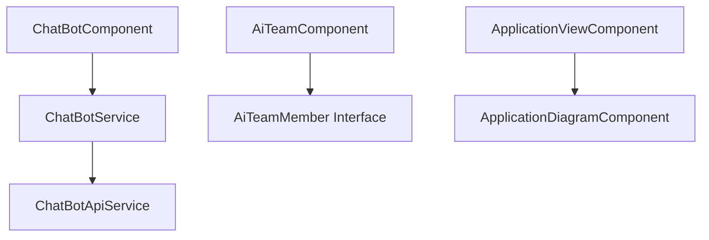
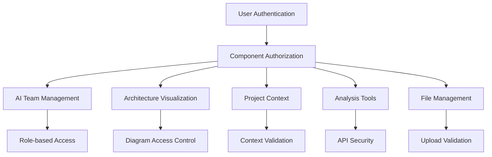
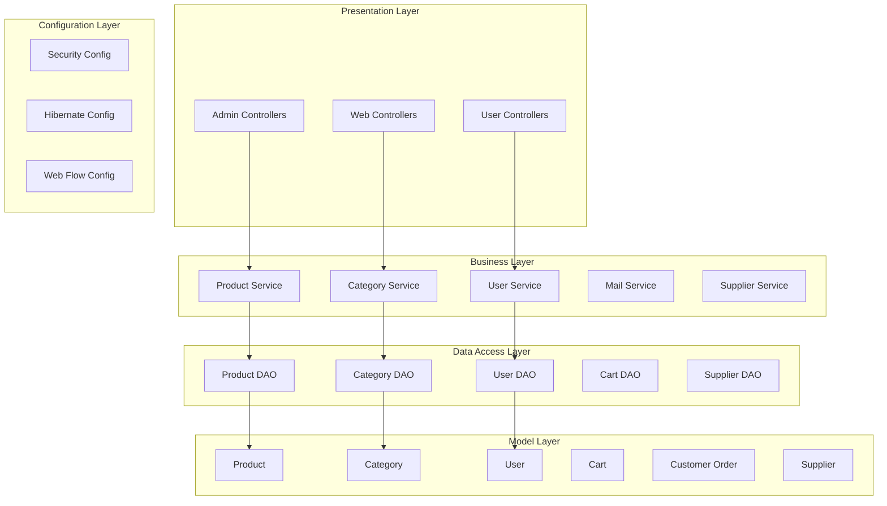
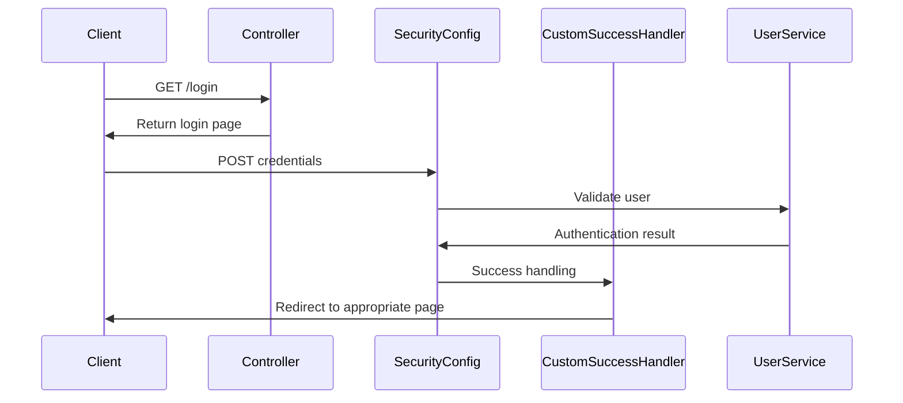
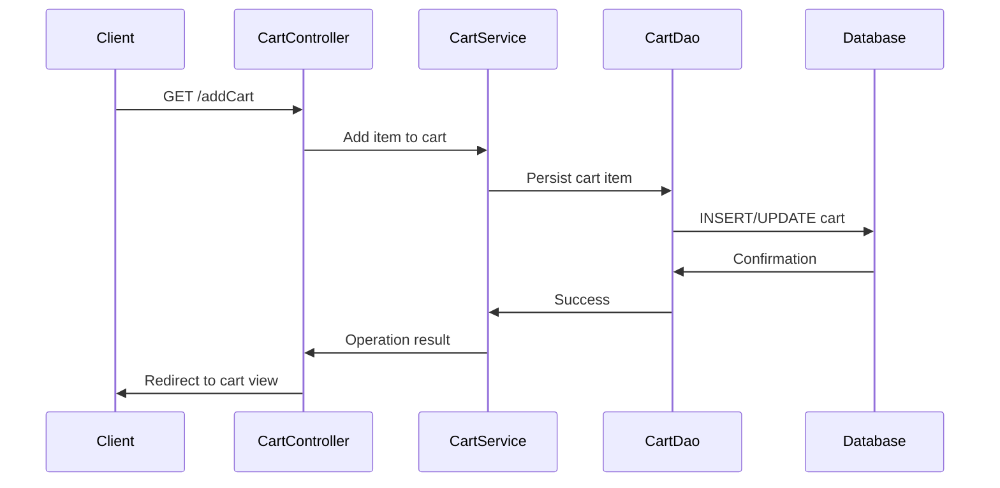
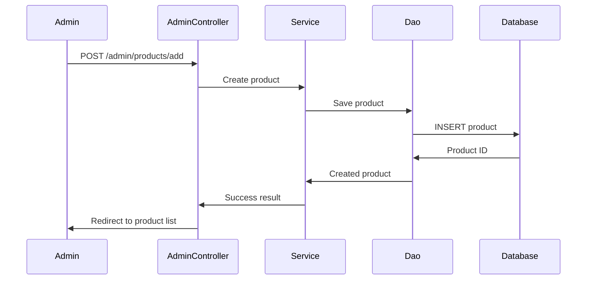
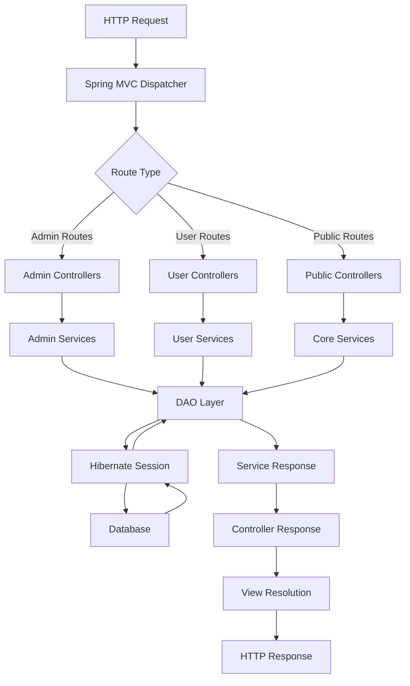
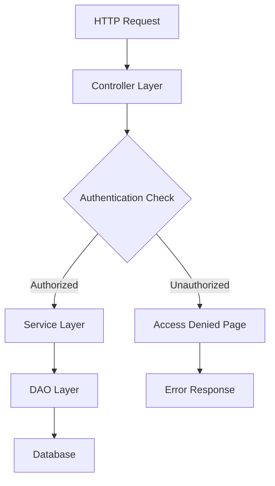
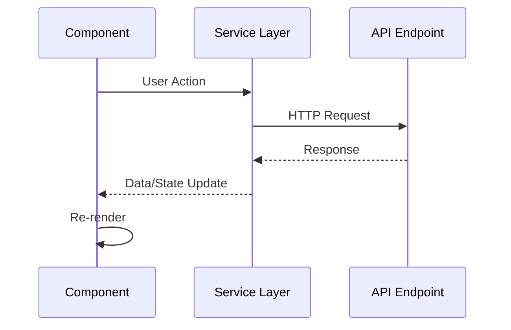

# architecture

## Project Overview

This project comprises 2 repositories: pace-lumen-ui, ECommerce. The sections below consolidate repository-specific evidence and shared concepts without dropping any participating repository.

## Repository Architecture

### pace-lumen-ui

#### Core System Components

##### Project Management Layer

- **ProjectService**: Core service orchestrating project operations including version selection, story generation, publishing, and scanning
- **ProjectEditService**: Specialized service for project editing operations
- **ProjectListComponent**: Management interface for project collections
- **ProjectEditNewComponent**: Primary editing interface with AI assistance and sync history

##### AI Integration Layer

- **AiTeamComponent**: Management interface for AI team functionality
- **AiTeamPublishDialogComponent**: Publishing workflow with AI team integration
- **ChatBotComponent & ChatBotService**: Conversational AI interface with streaming capabilities
- **ChatBotApiService**: API service layer for chatbot external communications

##### Analysis & Visualization Layer

- **ApplicationViewComponent**: Application-level project visualization
- **ArchitectureViewComponent**: Architecture-focused project views
- **ApplicationDiagramComponent**: Interactive diagram rendering
- **C4Component**: C4 model architecture visualization
- **ConsolidatedViewComponent**: Unified project view with module loading

##### Workflow Management Layer

- **Stepper**: Navigation component managing workflow state transitions
- **Upload**: File upload with drag-and-drop and project creation
- **Scan**: Analysis initiation with SSE connection capabilities
- **Tasks**: Task management with priority and risk classification
- **Stories**: Story management with priority and risk classification
- **Publish**: Publishing workflow with migration and board loading

##### Context & Configuration Layer

- **BusinessContextComponent**: Business context management
- **ArtifactFilesComponent**: File artifact management
- **SettingsComponent**: System configuration with version control
- **CustomBreadcrumbService**: Navigation breadcrumb management

##### Sequential Workflow Pattern

The system implements a guided workflow pattern where components transition users through analysis phases:

```
Scan → Tasks → Stories → Publish
```

data flow.

##### Service Layer Pattern

Business logic is encapsulated in dedicated services that components consume:
- API services handle external communications
- Business services manage domain logic
- Utility services provide cross-cutting concerns

##### Service Layer Pattern

- **Separation of Concerns**: Business logic isolated from UI components
- **API Abstraction**: Services like `ChatBotApiService` abstract external API complexity
- **Testability**: Service injection enables unit testing and mocking

##### Component Composition Pattern

Complex views are built through component composition:
- Container components manage state and coordination
- Presentation components handle UI rendering
- Specialized components encapsulate domain-specific functionality

#### Integration Points

The system integrates with external services through well-defined interfaces:
- **GitHub Integration**: Repository management and authentication
- **AI Services**: Team agent coordination and analysis
- **File Systems**: Artifact and project file management
- **Streaming Services**: Real-time updates via Server-Sent Events

##### 1. Project Management Subsystem

- **Components**: `ProjectListComponent`, `ProjectEditNewComponent`, `CreateProjectDialogComponent`
- **Services**: `ProjectService`, `ProjectEditService`
- **Responsibility**: Core project lifecycle management including creation, editing, and version control

##### 2. Analysis & Visualization Subsystem

- **Components**: `ApplicationViewComponent`, `ArchitectureViewComponent`, `ConsolidatedViewComponent`
- **Diagram Components**: `ApplicationDiagramComponent`, `C4Component`
- **Services**: `DiagramCaptureService`
- **Responsibility**: Architecture visualization, analysis status tracking, and diagram generation

##### 3. AI & Automation Subsystem

- **Components**: `AiTeamComponent`, `ChatBotComponent`, `WorkflowProgressComponent`
- **Services**: `ChatBotApiService`, `ChatBotService`
- **Responsibility**: AI-powered analysis, automated workflows, and intelligent assistance

#### Architectural Layers

##### Service Layer

- **Core Services**: `ProjectService` for project operations, `NewApiService` for backend communication
- **Specialized Services**: `ChatBotApiService` for AI interactions, `GitHubSettingsService` for repository management
- **Utility Services**: `CustomBreadcrumbService` for navigation state, `DiagramCaptureService` for export functionality

##### Data Layer

- **Interfaces**: Strongly-typed interfaces for `AgentFinding`, `ActivityProgressEntry`, `CapturedDiagram`
- **Models**: Project context models, AI team configurations, and workflow state management

#### Component Interaction Patterns

The application follows a structured workflow pattern:

```
Upload → Scan → Tasks → Stories → Publish
```

validation
- Provides navigation to the next step via dedicated methods
- Integrates with the central `ProjectService` for data persistence

#### Cross-Cutting Concerns

- **State Management**: Centralized through Angular services with reactive patterns
- **API Communication**: RESTful endpoints with SSE support for real-time updates
- **File Handling**: Drag-and-drop upload with artifact management
- **Authentication**: GitHub integration for repository access and workflow publishing

#### Core Component Architecture

##### Main Application Components

**AppComponent**
- Main application entry point with lazy loading overlay functionality
- Manages global application state and routing

**ProjectEditNewComponent**
- Central component for project editing with AI assistance and sync history features
- Orchestrates the project editing workflow

##### Workflow Components

The application implements a sequential workflow pattern:

```
Scan → Tasks → Stories → Publish
```

**Scan Component**
- Handles scanning functionality with SSE connection capabilities
- Navigates to Tasks component via `continueToTasks` method

**Tasks Component**
- Manages task operations with priority and risk classification
- Navigates to Stories component via `continueToStories` method

**Stories Component**
- Handles story management with priority and risk classification
- Navigates to Publish component via `continueToPublish` method

**Publish Component**
- Manages publishing functionality with methods for starting publishing, migration continuation, and board loading

##### Specialized View Components

**Architecture Visualization**
- `ArchitectureViewComponent`: Main architecture view with project name functionality
- `ApplicationViewComponent`: Application-specific view containing diagram components
- `ApplicationDiagramComponent`: Renders application diagrams using ArchitectureDiagramJson interface
- `C4Component`: Specialized C4 architecture diagram rendering
- `ConsolidatedViewComponent`: Consolidated project view with module loading and diagram functionality

**Business Context**
- `BusinessContextComponent`: Manages business context view with project name functionality

##### AI and Chat Components

**AI Team Management**
- `AiTeamComponent`: Manages AI team functionality using AiTeamMember interface
- `AiTeamPublishDialogComponent`: Dialog for AI team publishing with workflow selection and connection management

**Chat System**
- `ChatBotComponent`: UI component with message handling and scrolling functionality
- Uses `ChatBotService` for message operations
- `ChatBotService` integrates with `ChatBotApiService` for external API operations

##### File and Artifact Management

**File Operations**
- `Upload`: File upload component with drag-and-drop functionality and project creation from path
- `ArtifactFilesComponent`: Manages artifact files in project edit context
- `ArtifactFileViewerComponent`: Views individual artifact files

##### Project Management Components

**Project Operations**
- `ProjectListComponent`: Displays and manages project lists with download and navigation functionality
- `CreateProjectDialogComponent`: Dialog for project creation with repository management and authentication handling
- `Versions`: Version management component with selection and popup functionality

**Settings and Configuration**
- `SettingsComponent`: Settings management with version control and ontology mode configuration
- `ConnectionReposComponent`: Manages GitHub tool connection repositories

##### Utility Components

**UI Components**
- `Stepper`: Navigation stepper component with step state management
- `CustomLoaderComponent`: Custom loading component
- `AnalysisStatusBadgeComponent`: Displays analysis status badges
- `WorkflowProgressComponent`: Tracks and displays workflow progress with polling functionality

#### Component Dependencies

##### Service Layer Integration

**Core Services**
- `ProjectService`: Core service for project operations including version selection, story generation, publishing, and scanning
- `ProjectEditService`: Specialized service for project editing operations
- `CustomBreadcrumbService`: Provides breadcrumb functionality with mode and prefix management

**API Services**
- `ChatBotApiService`: Handles chat bot API interactions with streaming and session management
- Components interact with services through dependency injection

##### Data Flow Patterns

**Parent-Child Relationships**
- `ApplicationViewComponent` contains `ApplicationDiagramComponent`
- `ArtifactFilesComponent` contains `ArtifactFileViewerComponent`

**Service Dependencies**
- `ChatBotComponent` → `ChatBotService` → `ChatBotApiService`
- Components follow Angular's dependency injection pattern for service access

#### Data Flow Patterns

Integration follows consistent request-response patterns:

1. **Component Layer** - UI components initiate requests
2. **Service Layer** - Business logic

#### Interface-Driven Design

Components utilize well-defined interfaces for type safety:

- `CapturedDiagram`: Diagram capture artifacts for PDF export
- `ActivityProgressEntry`: Activity progress tracking
- `AgentFinding`: AI agent analysis findings
- `ChatMessage`: Chat message structure
- `AssetPublishState`: Asset publishing state management
- `AvailableRepoItem`: Repository item representation

This component architecture ensures modularity

##### Project Workflow Navigation

The application implements a sequential workflow for project operations:

- **Scan → Tasks**: `Scan` component continues to `Tasks` via `continueToTasks` method
- **Tasks → Stories**: `Tasks` component continues to `Stories` via `continueToStories` method  
- **Stories → Publish**: `Stories` component continues to `Publish` via `continueToPublish` method

##### API Request Routing

HTTP requests are routed through dedicated handlers:

- `DELETE /` → `deleteConfig` handler for configuration deletion
- `GET /` → `listAiTeamAgents` handler for AI team agent listing
- `PATCH /` → `updateValidationGap` handler for validation updates
- `POST /` → `cancelWorkflowRun` handler for workflow cancellation

##### Component Interaction Flow

Components interact through a layered service architecture:

1. **ChatBot Flow**: `ChatBotComponent` → `ChatBotService` → `ChatBotApiService`
2. **AI Team Management**: `AiTeamComponent` uses `AiTeamMember` interface
3. **Architecture Visualization**: `ApplicationViewComponent` contains `ApplicationDiagramComponent`
4. **File Management**: `ArtifactFilesComponent` contains `ArtifactFileViewerComponent`

#### Concurrency Model

The application leverages Angular's built-in concurrency patterns:

##### Asynchronous Operations

- HTTP requests are handled asynchronously through Angular's HttpClient
- Component state updates trigger change detection cycles
- Service layer manages concurrent API calls through observables

##### State Management

- Components maintain local state for UI interactions
- Services provide shared state across component boundaries
- API responses update component state through reactive patterns

##### Error Handling

- Stream errors are handled by dedicated `onStreamError` handler
- Component-level error boundaries prevent cascading failures
- Service layer implements retry logic for failed API calls

#### Error Handling

- **onStreamError** handler manages streaming connection failures
- Centralized error handling through service layer
- Graceful degradation for external service unavailability

#### External APIs

##### AI Team Management APIs

- **GET /** - Lists AI team agents for project configuration
- **DELETE /** - Removes configuration settings

##### GitHub Integration

- **GET /githubApp** - Retrieves GitHub application installation URL
- **GET /aidlcOrgRepos** - Fetches organization repositories from GitHub

##### GitHub Integration

- **GitHub API**: Repository management and authentication
- **GitHub App**: OAuth integration for repository access
- **Repository Services**: 
  - `AvailableRepoItem` and `AvailableReposResponse` interfaces for repository listing
  - GitHub settings service for connection management

##### GitHub Integration

- **Source Control Integration**: Direct repository access for project analysis
- **Authentication**: Secure OAuth flow for user repository access
- **Collaboration**: Multi-repository project support

##### GitHub Integration

- **GET /githubApp** - GitHub app installation URL retrieval handled by `getInstallUrl` function
- **GET /aidlcOrgRepos** - AIDLC organization repositories listing handled by `aidlcOrgRepos` function

##### Workflow Management

- **POST /** - Cancels running workflow executions
- **PATCH /** - Updates validation gap configurations

#### Service Layer Architecture

The integration layer follows a service-oriented pattern:



#### Service Layer Architecture

The deployment includes a service layer that handles:
- API interactions through dedicated service classes
- Data flow management with endpoints for configuration deletion (`DELETE /`) and AI team agent listing (`GET /`)
- Interface-driven data models for consistent data handling

##### Core Integration Services

- **ChatBotApiService** - Handles external chat bot API communications
- **ChatBotService** - Provides abstraction layer for message operations
- **AiTeamComponent** - Manages AI team member integrations

#### Primary Workflow Data Flow

The application follows a sequential workflow pattern for project analysis:

1. **Scan → Tasks → Stories → Publish Pipeline**
   - `Scan` component initiates analysis and continues to `Tasks` via `continueToTasks()` method
   - `Tasks` component processes task management and navigates to `Stories` via `continueToStories()` method  
   - `Stories` component handles story generation and proceeds to `Publish` via `continueToPublish()` method
   - Each transition maintains state and passes context forward through the workflow

#### API Request-Response Flows

The application implements standard REST API patterns:

1. **Configuration Management Flow**
   - `DELETE /` → `deleteConfig` handler for configuration removal
   - `GET /` → `listAiTeamAgents` handler for retrieving AI team agent listings
   - `PATCH /` → `updateValidationGap` handler for validation updates
   - `POST /` → `cancelWorkflowRun` handler for workflow cancellation

2. **GitHub Integration Flow**
   - `GET githubApp` → `getInstallUrl` handler for GitHub app installation URLs
   - `GET aidlcOrgRepos` → `aidlcOrgRepos` handler for organization repository listings

#### Chat Bot Communication Flow

The chat functionality implements a layered service architecture:

1. **User Interaction Layer**: `ChatBotComponent` handles UI interactions and message display
2. **Service Layer**: `ChatBotService` manages message state and business logic
3. **API Layer**: `ChatBotApiService` handles external API communications and streaming

Data flows from user input through the component to the service layer, then to external APIs, with responses flowing back through the same path.

#### Component Composition Flows

The application uses hierarchical component composition:

1. **Architecture Visualization**: `ApplicationViewComponent` contains `ApplicationDiagramComponent` for diagram rendering
2. **File Management**: `ArtifactFilesComponent` contains `ArtifactFileViewerComponent` for file display
3. **AI Team Management**: `AiTeamComponent` uses `AiTeamMember` interfaces for team member data

#### State Management Patterns

The application implements several state management approaches:

- **Service-based State**: Core services like `ProjectService` maintain application state
- **Component State**: Individual components manage local UI state
- **Navigation State**: `Stepper` component tracks workflow progress
- **Breadcrumb State**: `CustomBreadcrumbService` manages navigation context

These data flows ensure consistent state management

#### Security Layer Overview

#### Component Security Model



#### Security Controls by Component

| Component Category | Security Controls | Implementation |
|-------------------|------------------|----------------|
| AI Team Management | Role validation, lifecycle security | `ngOnInit`/`ngOnDestroy` patterns |
| Architecture Visualization | Diagram access control, data sanitization | Interface-driven models |
| Project Context | Context validation, file access control | Component isolation |
| Analysis Tools | API authentication, secure communications | Service layer security |
| File Management | Upload validation, content scanning | Type-safe interfaces |

#### API Security Architecture

##### Secure Data Flows

- **DELETE Operations**: Multi-factor authorization required for configuration deletion
- **GET Operations**: Context-aware data retrieval with user validation for AI team agent listings
- **Service Communications**: All API interactions through authenticated service layer

##### Security Gaps and Mitigations

- **Unknown Service Integration**: Service `ba3872ad-bf70-4305-ab4d-d48ee8038d31` requires security assessment
- **Component State Management**: Lifecycle management prevents security vulnerabilities from persistent state
- **Risk Classification**: Automated risk and priority classification ensures proper data handling

#### Component Distribution

- **AI Team Management Module**: Contains AiTeamComponent and AiTeamPublishDialogComponent for team configuration
- **Architecture Visualization Module**: Houses ApplicationDiagramComponent, ArchitectureViewComponent, and C4Component for system diagrams
- **Project Context Module**: Includes BusinessContextComponent and ArtifactFilesComponent for project management
- **Analysis Tools Module**: Provides AnalysisStatusBadgeComponent and ChatBotApiService for system analysis
- **File Management Module**: Contains ArtifactFileViewerComponent and UploadedFilesViewerComponent for document handling

#### Deployment Considerations

- Component-based architecture enables selective module deployment
- Service layer provides centralized API management
- Modular project editing workflow supports distributed development teams

##### Core Angular Framework

- **Angular Components**: Extensive use of Angular component architecture for UI modules
- **Angular Services**: Service layer pattern for business logic and API interactions
- **Angular Routing**: Route handlers for navigation and API endpoints

##### Component Hierarchy

```
AppComponent (Root)
├── ProjectEditNewComponent
│   ├── AiTeamComponent
│   ├── ApplicationViewComponent
│   │   └── ApplicationDiagramComponent
│   ├── ArchitectureViewComponent
│   │   └── C4Component
│   ├── BusinessContextComponent
│   ├── ChatBotComponent
│   └── ArtifactFilesComponent
│       └── ArtifactFileViewerComponent
├── ProjectListComponent
├── SettingsComponent
│   └── ConnectionReposComponent
└── WorkflowProgressComponent
```

##### Service Dependencies

- **ChatBotComponent** → **ChatBotService** → **ChatBotApiService**: Layered service architecture for chat functionality
- **ProjectService**: Core service for project operations (scanning, publishing, version management)
- **ProjectEditService**: Specialized service for project editing operations
- **CustomBreadcrumbService**: Navigation breadcrumb management
- **DiagramCaptureService**: Handles diagram capture for PDF export via `CapturedDiagram` interface

##### Data Flow Dependencies

- **Scan** → **Tasks** → **Stories** → **Publish**: Sequential workflow navigation
- **API Endpoints**: RESTful endpoints for CRUD operations
  - `DELETE /` → `deleteConfig`
  - `GET /` → `listAiTeamAgents`
  - `PATCH /` → `updateValidationGap`
  - `POST /` → `cancelWorkflowRun`

##### Third-Party Libraries

- **Mermaid/C4**: Architecture diagram rendering (C4Component)
- **File Upload Libraries**: Drag-and-drop functionality in Upload component
- **Server-Sent Events (SSE)**: Real-time updates in Scan component
- **PDF Export**: Document generation capabilities

##### Backend API Dependencies

- **AI Team Agents API**: External AI service integration
- **Workflow Management API**: Progress tracking and cancellation
- **Project Analysis API**: Code scanning and analysis services
- **Artifact Management API**: File upload and storage services

##### Angular Framework Choice

- **Component Reusability**: Modular architecture enables component reuse across different project views
- **TypeScript Integration**: Strong typing through interfaces like `AgentFinding`, `ActivityProgressEntry`, and `ChatMessage`
- **Reactive Programming**: Observable patterns for real-time updates and streaming data

##### External AI Services

- **Enhanced Analysis**: AI-powered code analysis and recommendations
- **Automated Documentation**: AI-generated project insights and findings
- **Workflow Optimization**: Intelligent task and story generation

#### Risk Assessment

##### High-Risk Dependencies

- **Unknown Service**: `ba3872ad-bf70-4305-ab4d-d48ee8038d31` - Unidentified service with unclear functionality
- **GitHub API Rate Limits**: Potential throttling for high-volume repository operations
- **External AI Service Availability**: Dependency on third-party AI services for core functionality

##### Medium-Risk Dependencies

- **Browser Compatibility**: Client-side diagram rendering and file upload features
- **Real-time Connections**: SSE and streaming dependencies for live updates

##### Mitigation Strategies

- **Service Identification**: Investigate and document unknown service functionality
- **API Rate Limiting**: Implement caching and request optimization
- **Fallback Mechanisms**: Graceful degradation when external services are unavailable
- **Progressive Enhancement**: Core functionality available without advanced features

#### REST API Endpoints

The application exposes several REST API endpoints for core functionality:

##### Configuration Management

- **DELETE /** - Configuration deletion endpoint handled by `deleteConfig` function
- **PATCH /** - Configuration updates handled by `updateValidationGap` function

##### AI Team Operations

- **GET /** - List AI team agents handled by `listAiTeamAgents` function
- **POST /** - Workflow operations handled by `cancelWorkflowRun` function

#### Service Interfaces

The application implements several key service interfaces:

##### Data Interfaces

- **CapturedDiagram** - Interface for diagram capture artifacts ready for PDF export
- **ActivityProgressEntry** - Interface for tracking activity progress entries
- **AgentFinding** - Interface representing findings from AI agents in project analysis
- **ChatMessage** - Interface defining chat message structure for chat bot service
- **ArchitectureDiagramJson** - Interface for architecture diagram JSON representation
- **AiTeamAgentDetail** - Interface for detailed AI team agent information

#### Component Communication

Components communicate through well-defined interfaces:

- **ChatBotComponent** → **ChatBotService** → **ChatBotApiService** (layered service architecture)
- **ApplicationViewComponent** contains **ApplicationDiagramComponent** for diagram rendering
- **ArtifactFilesComponent** contains **ArtifactFileViewerComponent** for file viewing
- Navigation flow: **Scan** → **Tasks** → **Stories** → **Publish** components

### ECommerce

#### Technical Foundation

The repository implements a layered Spring MVC architecture with:

- **Web Layer**: Controllers handling both user and admin interfaces
- **Service Layer**: Business logic implementation with service interfaces
- **Data Access Layer**: DAO pattern with Hibernate integration
- **Model Layer**: JPA entities representing business domain
- **Configuration Layer**: Spring configuration for MVC, Security, and Hibernate

#### System Architecture



#### Core Components

##### Administrative Interface

- **Admin Controllers**: Specialized controllers for administrative functions
  - `AdminCategoryController`: Category management CRUD operations
  - `AdminProductController`: Product management operations
  - `AdminSupplierController`: Supplier management operations
  - `AdminUserController`: User management operations

##### Administrative Interface

```
GET  /admin/dashboard                   # Admin dashboard
GET  /admin/categorys/category         # Category management
POST /admin/categorys/add              # Add new category
GET  /admin/products/product           # Product management
GET  /admin/users/user                 # User management
```

##### Business Logic Layer

- **Service Interfaces & Implementations**: Encapsulate business rules
  - `CategoryService`/`CategoryServiceImpl`: Category business logic
  - `ProductService`/`ProductServiceImpl`: Product business logic
  - `UserService`/`UserServiceImpl`: User business logic
  - `MailService`/`MailServiceImpl`: Email functionality
  - `SupplierService`/`SupplierServiceImpl`: Supplier business logic

##### Business Logic Layer

- **Service Interfaces & Implementations**:
  - `CategoryService`/`CategoryServiceImpl`: Category business logic
  - `ProductService`/`ProductServiceImpl`: Product operations
  - `UserService`/`UserServiceImpl`: User management
  - `SupplierService`/`SupplierServiceImpl`: Supplier operations
  - `MailService`/`MailServiceImpl`: Email functionality

##### Data Access Layer

- **DAO Pattern Implementation**: Data persistence abstraction
  - `CategoryDao`/`CategoryDaoImpl`: Category data operations
  - `ProductDao`/`ProductDaoImpl`: Product data operations
  - `UserDao`/`UserDaoImpl`: User data operations
  - `CartDao`/`CartDaoImpl`: Shopping cart data operations
  - `SupplierDao`/`SupplierDaoImpl`: Supplier data operations

##### Data Access Layer

- **DAO Pattern Implementation**:
  - `CartDao`/`CartDaoImpl`: Cart data operations
  - `CategoryDao`/`CategoryDaoImpl`: Category persistence
  - `ProductDao`/`ProductDaoImpl`: Product data access
  - `UserDao`/`UserDaoImpl`: User data management
  - `SupplierDao`/`SupplierDaoImpl`: Supplier data operations

#### Data Access Layer

API controllers interact with the data layer through:
- **DAO Interfaces**: CartDao, CategoryDao, ProductDao, SupplierDao, UserDao
- **Service Layer**: Business logic interfaces (CategoryService, ProductService, etc.)
- **Implementation Classes**: Concrete implementations of DAO and Service interfaces

##### Separation of Concerns

The architecture strictly separates:
- **Presentation logic** (Controllers)
- **Business logic** (Services)
- **Data access logic** (DAOs)
- **Domain models** (Entities)

##### Separation of Concerns

- **Controllers**: Handle HTTP requests/responses, input validation, and routing
- **Services**: Implement business logic, transaction management, and orchestration
- **DAOs**: Provide data access abstraction and persistence operations
- **Models**: Represent domain entities and data structures
- **Configuration**: Manage application setup, security, and framework integration

##### Design Patterns

1. **Model-View-Controller (MVC)**
   - Controllers handle HTTP requests
   - Models represent domain entities
   - Views render user interfaces

2. **Data Access Object (DAO) Pattern**
   - Abstracts database operations
   - Provides clean separation between business and data layers

3. **Service Layer Pattern**
   - Encapsulates business logic
   - Provides transaction boundaries
   - Coordinates between controllers and DAOs

#### Configuration Architecture

##### Security Configuration

- `SecurityConfiguration`: Spring Security setup with authentication and authorization
- `CustomSuccessHandler`: Role-based redirection logic for admin, DBA, and user roles
- `SecurityWebApplicationInitializer`: Security web application initialization

##### Application Configuration

- `HelloWorldConfiguration`: Web flow, mail sender, and view resolver setup
- `HibernateConfiguration`: Database configuration with Hibernate ORM
- `SpringMvcInitializer`: Spring MVC initialization
- `WebFlowConfig`: Web flow configuration for complex user interactions

#### Core Subsystems

##### Domain Model Layer

- **Core Entities**:
  - `User`: User accounts with authentication and profile data
  - `Product`: Product catalog with pricing and descriptions
  - `Cart`: Shopping cart with user associations
  - `Category`: Product categorization
  - `CustomerOrder`: Order management
  - `Supplier`: Supplier information
  - `Roles`: User role definitions
  - `ShippingDetails`: Order shipping information

##### User-Facing Subsystem

- Public product browsing and search
- User registration and authentication
- Shopping cart management
- Wishlist functionality
- Account profile management

##### Administrative Subsystem

- Admin dashboard with role-based access
- Category, product, and supplier management
- User administration
- System configuration

##### Security Subsystem

- `SecurityConfiguration`: Spring Security setup
- `CustomSuccessHandler`: Role-based authentication routing
- `SecurityWebApplicationInitializer`: Security initialization

#### Configuration Layer

- `HelloWorldConfiguration`: Web flow and view resolver setup
- `HibernateConfiguration`: Database and ORM configuration
- `WebFlowConfig`: Web flow configuration
- `SpringMvcInitializer`: MVC initialization

#### Web Layer Components

##### Controllers

- **CartController**: Manages shopping cart operations including add, remove, and view cart functionality
- **ProductController**: Handles product display, search, and product detail page operations
- **UserAccountController**: Manages user account operations including registration, login, and profile management
- **HelloWorldController**: Provides basic application endpoints

##### Admin Controllers

- **AdminCategoryController**: Administrative controller for category management including CRUD operations
- **AdminProductController**: Handles admin product management operations
- **AdminSupplierController**: Manages supplier administration functions
- **AdminUserController**: Provides user management capabilities for administrators

#### Service Layer Components

#### Data Access Layer Components

##### DAO Interfaces and Implementations

- **CartDao/CartDaoImpl**: Cart data access operations with update functionality
- **CategoryDao/CategoryDaoImpl**: Category data persistence operations
- **ProductDao/ProductDaoImpl**: Product data access management
- **UserDao/UserDaoImpl**: User data persistence operations
- **SupplierDao/SupplierDaoImpl**: Supplier data access functionality

#### Model Layer Components

##### Domain Entities

- **User**: User entity with authentication properties, cart, wishlist, and role associations
- **Product**: Product entity with properties for name, price, description, image, category, and discount
- **Cart**: Shopping cart entity with product, user, quantity, and total amount properties
- **Category**: Product categorization entity
- **CustomerOrder**: Order entity managing order details including total, date, status, and address
- **Supplier**: Supplier information entity
- **Roles**: User role management entity
- **ShippingDetails**: Shipping information model

#### Configuration Components

##### Core Configuration

- **HelloWorldConfiguration**: Spring configuration for web flow, mail sender, and view resolver setup
- **HibernateConfiguration**: Database configuration managing Hibernate session factory, transaction manager, and data source
- **SecurityConfiguration**: Spring Security configuration with authentication and authorization setup
- **WebFlowConfig**: Web flow configuration setup

##### Security Components

- **CustomSuccessHandler**: Handles authentication success with role-based redirection logic including admin, DBA, and user role checks
- **SecurityWebApplicationInitializer**: Security web application initialization
- **SpringMvcInitializer**: Spring MVC configuration initialization

#### Component Interactions

##### Request Flow

1. **HTTP Requests** → **Controllers** (CartController, ProductController, etc.)
2. **Controllers** → **Service Layer** (CategoryService, ProductService, etc.)
3. **Services** → **DAO Layer** (CategoryDao, ProductDao, etc.)
4. **DAOs** → **Database** via Hibernate

##### Key Dependencies

- Controllers depend on Service interfaces
- Service implementations depend on DAO interfaces
- DAO implementations use Hibernate for persistence
- Security configuration integrates CustomSuccessHandler for authentication flow
- All components use dependency injection for loose coupling

#### Component Responsibilities

##### User Authentication Flow



##### Shopping Cart Operations



##### Admin Management Operations



#### Concurrency Considerations

##### Thread Safety

- **Controllers**: Stateless by design, thread-safe for concurrent requests
- **Services**: Singleton beans with no instance state, inherently thread-safe
- **DAOs**: Stateless data access objects, safe for concurrent operations
- **Entity Models**: Request-scoped objects, no shared state between threads

##### Database Concurrency

- **Transaction Management**: Spring's `@Transactional` annotations ensure ACID properties
- **Connection Pooling**: Database connections managed through connection pools
- **Optimistic Locking**: Entity versioning prevents concurrent modification conflicts

##### Session Management

- **User Sessions**: HTTP sessions maintain user state across requests
- **Shopping Cart**: Cart data persisted in database, not session-dependent
- **Authentication**: Spring Security manages authentication state per session

#### Performance Patterns

##### Request Processing

- **Stateless Design**: Controllers and services maintain no instance state
- **Lazy Loading**: Entity relationships loaded on-demand
- **Connection Reuse**: Database connections pooled and reused

##### Scalability Considerations

- **Horizontal Scaling**: Stateless architecture supports multiple application instances
- **Database Scaling**: DAO pattern abstracts data access for potential sharding
- **Caching Strategy**: Service layer positioned for caching implementation

#### External API Architecture

The ECommerce application exposes a comprehensive REST API for both administrative and user-facing operations. The API follows RESTful conventions and is organized into distinct functional areas.

##### API Structure

**Administrative APIs**
- `/admin/dashboard` - Central admin interface
- `/admin/categorys/*` - Category management operations
- `/admin/products/*` - Product management operations  
- `/admin/suppliers/*` - Supplier management operations
- `/admin/users/*` - User management operations

**User-Facing APIs**
- `/login`, `/logout`, `/register` - Authentication endpoints
- `/{username}/cart` - Shopping cart operations
- `/user/{username}/wishlist` - Wishlist management
- `/user/{username}/account` - Account management
- `/addCart`, `/addWishlistItem` - Item management

**Public APIs**
- `/` - Home page
- `/aboutUs` - Information pages
- `/SearchController` - Product search functionality

##### Integration Patterns

**Request Routing**

```
HTTP Request → Controller → Service Layer → DAO Layer → Database
```

The application uses Spring MVC's request mapping to route incoming HTTP requests to appropriate controller methods. Each controller delegates business logic to service implementations.

**Service Integration**
- **MailService**: Handles email notifications and communications
- **Authentication**: Custom success handlers for login flows
- **Security**: Role-based access control for admin vs user endpoints

##### Data Exchange Format

All API endpoints return appropriate view names for server-side rendering

##### External System Interfaces

**Email Integration**
- `MailService` and `MailServiceImpl` provide email functionality
- Used for user notifications and account-related communications

**Security Integration**
- Spring Security configuration with custom success handlers
- Role-based access control separating admin and user functionality
- Session-based authentication management

#### Request Processing Flow



#### Authentication and Authorization Flow

The application implements role-based access control through Spring Security:

1. **Login Request**: User credentials are submitted to the authentication endpoint
2. **Security Filter Chain**: Spring Security intercepts and validates credentials
3. **Custom Success Handler**: `CustomSuccessHandler` processes successful authentication with role-based redirection logic
4. **Role Determination**: System checks for admin, DBA, or user roles
5. **Route Redirection**: Users are redirected to appropriate interfaces based on their roles

#### Shopping Cart Data Flow

The shopping cart functionality demonstrates the complete data flow pattern:

1. **Add to Cart Request**: User initiates add to cart action via `CartController`
2. **Service Delegation**: Controller delegates to cart service layer for business logic
3. **Data Persistence**: Service uses `CartDao` and `CartDaoImpl` for database operations
4. **Entity Relationships**: Cart entity maintains associations with User and Product entities
5. **Response Generation**: Updated cart data flows back through the layers to the user interface

#### Admin Management Flow

Administrative operations follow a consistent pattern across all management modules:

1. **Admin Dashboard Access**: Authenticated admin users access the dashboard interface
2. **Module Selection**: Admin selects specific management module (Categories, Products, Users, Suppliers)
3. **CRUD Operations**: Admin controllers (`AdminCategoryController`, `AdminProductController`, etc.) handle create, read, update, delete operations
4. **Service Processing**: Each admin controller delegates to corresponding service implementations
5. **Data Layer**: Services interact with DAO implementations for database operations
6. **Response Rendering**: Results are rendered through appropriate admin interface views

#### User Account Management Flow

User account operations demonstrate the application's user-centric data flow:

1. **Account Access**: Users access account functionality through `UserAccountController`
2. **Profile Operations**: Account details, wishlist, and cart operations are processed
3. **Update Processing**: Account updates flow through `updateAccountDetails` handler
4. **Data Validation**: Service layer validates and processes account changes
5. **Persistence**: User data is persisted through `UserDao` and `UserDaoImpl`
6. **Associated Data**: User entity maintains relationships with Cart and Wishlist entities

#### Configuration and Initialization Flow

1. **Spring Initialization**: `SpringMvcInitializer` sets up the web application context
2. **Security Setup**: `SecurityConfiguration` and `SecurityWebApplicationInitializer` establish security filters
3. **Database Configuration**: `HibernateConfiguration` configures session factory and transaction management
4. **Web Flow Setup**: `HelloWorldConfiguration` and `WebFlowConfig` establish view resolution and web flow
5. **Service Wiring**: Dependency injection wires controllers, services, and DAOs together

maintenance of the application components.

#### Security Layer Integration

The security architecture is integrated across all application layers:

##### Controller Layer Security

- **Access Control**: Controllers implement authorization checks before processing requests
- **Error Handling**: Dedicated access denied controller (`/Access_Denied`) manages unauthorized access scenarios
- **Request Validation**: Input validation and sanitization at the controller level

##### Service Layer Security

- **Business Logic Protection**: Security rules enforced within service methods
- **Data Access Control**: Services validate user permissions before data operations
- **Transaction Security**: Secure handling of business transactions and data modifications

##### Data Access Security

- **DAO Layer Protection**: Data access objects implement security constraints
- **Query Security**: Parameterized queries and input validation prevent injection attacks
- **Data Isolation**: User-specific data access controls at the persistence layer

#### Security Flow Architecture



#### Security Patterns

- **Layered Security**: Security controls implemented at each architectural layer
- **Fail-Safe Defaults**: Unauthorized access results in secure denial rather than exposure
- **Separation of Concerns**: Security logic separated from business logic while maintaining integration

#### Deployment Topology

#### Environment Tiers

#### Deployment Components

| Component | Purpose | Scaling |
|-----------|---------|----------|
| Database Server | Data persistence layer | Vertical/Clustering |

#### Infrastructure Requirements

WebLogic)
- **Database**: Relational database with JDBC support
- **Network**: HTTP/HTTPS connectivity for web access
- **Storage**: File system access for application logs

##### Framework Dependencies

- **Spring Framework**: Core dependency providing MVC architecture, dependency injection, and web flow capabilities
  - Spring MVC for web layer implementation
  - Spring Security for authentication and authorization
  - Spring Web Flow for complex navigation flows
- **Hibernate ORM**: Object-relational mapping framework for database operations
  - Session factory management through `HibernateConfiguration`
  - Transaction management integration

##### Layer Dependencies

**Controller Layer Dependencies:**
- Controllers depend on Service interfaces for business logic
- `CartController` → `CartService` (implied)
- `ProductController` → `ProductService`
- Admin controllers → respective service implementations

**Service Layer Dependencies:**
- Service implementations depend on DAO interfaces for data access
- `CategoryServiceImpl` → `CategoryDao`
- `ProductServiceImpl` → `ProductDao`
- `UserServiceImpl` → `UserDao`
- `SupplierServiceImpl` → `SupplierDao`

**Data Access Layer Dependencies:**
- DAO implementations depend on Hibernate session factory
- All DAO implementations (`CartDaoImpl`, `CategoryDaoImpl`, `ProductDaoImpl`, etc.) depend on `HibernateConfiguration`

##### Security Dependencies

- `SecurityConfiguration` depends on `CustomSuccessHandler` for authentication flow
- Role-based access control depends on `Roles` entity
- Authentication success handling requires user role validation

##### Database Dependencies

- **Database Server**: Required for data persistence (type not specified in evidence)
- Connection pooling and transaction management through Hibernate

##### Mail Service Dependencies

- **Mail Server**: External SMTP server for email functionality
- `MailServiceImpl` requires mail server configuration for user notifications

##### Web Dependencies

- **Servlet Container**: Required for web application deployment
- Static resource serving for CSS, JavaScript, and image files

##### Spring Framework Selection

- **MVC Pattern**: Provides clear separation of concerns between presentation, business, and data layers
- **Dependency Injection**: Enables loose coupling and testability
- **Security Integration**: Built-in authentication and authorization capabilities
- **Configuration Management**: Annotation-based configuration reduces XML complexity

##### Hibernate ORM Selection

- **Object-Relational Mapping**: Simplifies database operations with entity mapping
- **Transaction Management**: Automatic transaction handling and rollback capabilities
- **Performance Optimization**: Lazy loading and caching mechanisms

##### Layered Architecture Benefits

- **Maintainability**: Clear separation allows independent layer modifications
- **Testability**: Interface-based design enables easy mocking and unit testing
- **Scalability**: Service layer can be extracted for microservices architecture
- **Reusability**: Business logic in services can be reused across different controllers

#### Critical Dependencies

1. **Database Connectivity**: Application cannot function without database access
2. **Spring Context**: All dependency injection relies on Spring container
3. **Security Configuration**: Authentication and authorization are fundamental requirements
4. **Session Management**: User state management depends on proper session handling

#### API Architecture

The system follows a layered API design with clear separation between:
- **Public APIs**: Customer-facing endpoints for shopping, account management, and product browsing
- **Admin APIs**: Administrative endpoints for system management and configuration
- **Authentication APIs**: Security endpoints for user login, registration, and access control

#### Core API Controllers

##### Public Customer APIs

- **ProductController**: Handles product display, search, and detail operations
- **CartController**: Manages shopping cart operations (add, remove, view)
- **UserAccountController**: User account management and profile operations
- **HelloWorldController**: Main application entry points

##### Administrative APIs

- **AdminCategoryController**: Category CRUD operations
- **AdminProductController**: Product management operations
- **AdminSupplierController**: Supplier management operations
- **AdminUserController**: User administration operations
- **AdminController**: Base administrative functionality

#### Key API Endpoints

##### Authentication & Access

```
GET  /                    # Home page
GET  /login              # User login
GET  /register           # User registration
GET  /Access_Denied      # Access denied page
```

##### User Operations

```
GET  /account                                    # User account page
GET  /user/{username}/account                    # User-specific account
POST /updatingAccount-{id}                      # Update account details
POST /user/{username}/account/edit-details/updatingAccount/{user_id}  # Update user details
```

##### Shopping Features

```
GET  /addCart                           # Add to cart page
GET  /{username}/cart                   # User shopping cart
GET  /user/addWishlistItem             # Add wishlist item
GET  /user/{username}/wishlist         # User wishlist
```

#### API Security

The application implements role-based access control through:
- **CustomSuccessHandler**: Manages authentication success with role-based redirection
- **SecurityConfiguration**: Configures Spring Security for API protection
- **Role-based routing**: Different access levels for admin, DBA, and regular users

## Architecture Overview

### pace-lumen-ui

The pace-lumen-ui is an Angular-based web application designed for project analysis, AI-assisted development, and architecture visualization. The system follows a modular, component-driven architecture that supports complex workflows for software project management and analysis.

### ECommerce

The ECommerce application follows a traditional **Spring MVC layered architecture** with clear separation of concerns and established design patterns.

## High-Level Design

### pace-lumen-ui

The pace-lumen-ui application follows a layered Angular architecture with clear separation of concerns across presentation, service, and data layers.

### ECommerce

The ECommerce application follows a layered architecture pattern with clear separation of concerns across multiple subsystems:

## Component Design

### pace-lumen-ui

### ECommerce

The ECommerce application follows a layered architecture with clear separation of concerns across multiple component types:

## Runtime Design

## Integration Design

## Data Flow Design

### pace-lumen-ui

The pace-lumen-ui application implements several key data flow patterns that orchestrate user interactions, API communications, and component state management.

### ECommerce

The ECommerce application follows a structured data flow pattern through its layered architecture, ensuring clear separation of concerns and maintainable code organization.

## Security Architecture

## Deployment Architecture

### pace-lumen-ui

The Pace Lumen UI follows a standard Angular application deployment pattern with modular component distribution.

### ECommerce

## Dependency Analysis

## APIs and Interfaces

### pace-lumen-ui

### ECommerce

The ECommerce application exposes a comprehensive REST API architecture built on Spring MVC, providing both public customer-facing endpoints and administrative interfaces.

### Architectural Patterns

#### pace-lumen-ui

#### ECommerce

1. **Model-View-Controller (MVC)**: Clear separation between presentation, business logic, and data
2. **Data Access Object (DAO)**: Abstracted data persistence layer
3. **Service Layer**: Encapsulated business logic with interface-based design
4. **Dependency Injection**: Spring-managed component lifecycle and dependencies
5. **Role-Based Access Control**: Segregated admin and user functionalities

#### Core Services

##### pace-lumen-ui

- **ProjectService** - Central service for project operations including version selection, story generation, publishing, and scanning
- **ChatBotApiService** - API service for chatbot functionality with streaming and session management
- **ChatBotService** - Service layer for chatbot operations including message management
- **CustomBreadcrumbService** - Navigation breadcrumb functionality with mode and prefix management
- **ProjectEditService** - Service for project editing operations

##### ECommerce

- **CategoryService/CategoryServiceImpl**: Handles category business logic operations
- **ProductService/ProductServiceImpl**: Manages product-related business logic
- **UserService/UserServiceImpl**: Implements user management business logic
- **SupplierService/SupplierServiceImpl**: Handles supplier business operations
- **MailService/MailServiceImpl**: Provides email functionality

### Data Flow Architecture

#### pace-lumen-ui

The application follows unidirectional data flow patterns:

1. **API Layer**: RESTful endpoints handle external data exchange
   - `GET /` → `listAiTeamAgents` for AI team data retrieval
   - `DELETE /` → `deleteConfig` for configuration management

2. **Service Layer**: Services orchestrate data transformation and business logic

3. **Component Layer**: Components consume services and manage local state

4. **UI Layer**: Templates render data and capture user interactions

#### ECommerce

1. **Request Processing Flow**:

   ```
   HTTP Request → Controller → Service → DAO → Database
   Database → DAO → Service → Controller → HTTP Response
   ```

2. **Authentication Flow**:

   ```
   Login Request → SecurityConfiguration → CustomSuccessHandler → Role-based Redirect
   ```

3. **Business Operation Flow**:

   ```
   User Action → Controller → Service (Business Logic) → DAO (Data Access) → Entity Model
   ```

This layered architecture ensures maintainability, scalability, and clear separation of responsibilities throughout the ecommerce application.

### Dependency Rationale

### Design Philosophy

#### pace-lumen-ui

- **Component-Based Architecture**: Built on Angular framework with discrete, contract-based interactions using TypeScript interfaces
- **Modular Workflow Management**: Sequential workflow components that guide users through project analysis phases

#### ECommerce

### Execution Flows

### External Dependencies

#### pace-lumen-ui

- GitHub API for repository and workflow management
- AI/ML services for team agent functionality
- Real-time messaging systems for chat bot operations

#### pace-lumen-ui

### Internal Dependencies

#### Presentation Layer

##### pace-lumen-ui

- **Main Application**: `AppComponent` with lazy loading overlay functionality
- **Navigation**: `Stepper` component for workflow navigation with breadcrumb support via `CustomBreadcrumbService`
- **UI Components**: Modular components for specific functionality (Upload, Scan, Tasks, Stories, Publish)

##### ECommerce

- **Web Controllers**: Handle HTTP requests and responses
  - `HelloWorldController`: Main application controller
  - `ProductController`: Product display and search operations
  - `CartController`: Shopping cart management
  - `UserAccountController`: User account operations

##### ECommerce

- **Web Controllers**: Handle HTTP requests and responses
  - `HelloWorldController`: Main application entry point
  - `CartController`: Shopping cart operations
  - `ProductController`: Product display and search
  - `UserAccountController`: User account management
- **Admin Controllers**: Administrative interface management
  - `AdminCategoryController`: Category CRUD operations
  - `AdminProductController`: Product management
  - `AdminSupplierController`: Supplier management
  - `AdminUserController`: User administration

### Purpose

#### pace-lumen-ui

- **Project Management**: Create, edit, and manage software projects with comprehensive workflow support
- **AI Team Integration**: Configure and manage AI-powered development agents for automated analysis and assistance
- **Architecture Visualization**: Generate and interact with C4 diagrams, application diagrams, and system architecture views
- **Code Analysis**: Monitor analysis status, review findings, and track project health metrics
- **File Management**: Upload, view, and manage project artifacts and documentation

#### ECommerce

This repository serves as a complete e-commerce solution offering:

- **Customer Experience**: Product browsing, shopping cart management, wishlist functionality, user account management, and order processing
- **Administrative Management**: Comprehensive admin dashboard for managing products, categories, suppliers, users, and orders
- **Security & Authentication**: Role-based access control with separate user and admin interfaces

## Repository Overview

### pace-lumen-ui

The **pace-lumen-ui** repository is an Angular-based user interface application designed for comprehensive project management, AI team collaboration, and software architecture visualization. This frontend application serves as the primary interface for developers and teams to interact with project analysis tools, manage AI-powered development workflows, and visualize system architectures.

### ECommerce

The ECommerce repository is a comprehensive Spring MVC web application that implements a full-featured e-commerce platform. Built using Java and following enterprise-grade architectural patterns, this application provides both customer-facing shopping functionality and administrative management capabilities.

### Request Lifecycle

#### pace-lumen-ui

The application follows a standard Angular request lifecycle pattern with clear separation between UI components and service layers:



#### ECommerce

The ECommerce application follows a standard Spring MVC request processing lifecycle:

1. **Request Reception**: HTTP requests are received by the Spring DispatcherServlet
2. **Handler Mapping**: Requests are mapped to appropriate controller methods based on URL patterns
3. **Controller Processing**: Controllers handle the request and delegate business logic to services
4. **Service Layer Execution**: Services perform business operations and coordinate with DAOs
5. **Data Access**: DAOs interact with the database for persistence operations
6. **Response Generation**: Controllers return view names or data for response rendering

### Scope

#### pace-lumen-ui

- **Project Context Management**: Business context definition, artifact file handling, and project configuration
- **Interactive Visualization**: Dynamic architecture diagrams with C4 model support and application topology views
- **AI-Powered Workflows**: Integration with AI agents for code analysis, recommendations, and automated tasks
- **Analysis Tools**: Real-time status monitoring, progress tracking, and results visualization
- **Settings and Configuration**: GitHub integration, tool connections, and system preferences

Built with Angular framework, the application follows modern component-based architecture patterns with a clear separation between presentation, business logic, and data access layers.

#### ECommerce

- **Product Management**: Category-based product organization with supplier relationships
- **User Management**: Customer registration, authentication, and profile management
- **Shopping Operations**: Cart management, wishlist functionality, and order processing
- **Administrative Functions**: Complete CRUD operations for all business entities
- **Security Layer**: Spring Security integration with custom authentication handlers

### System Boundaries