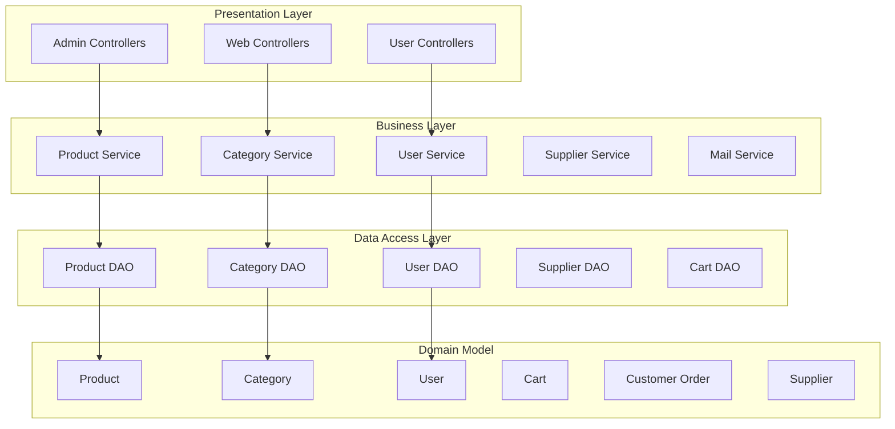
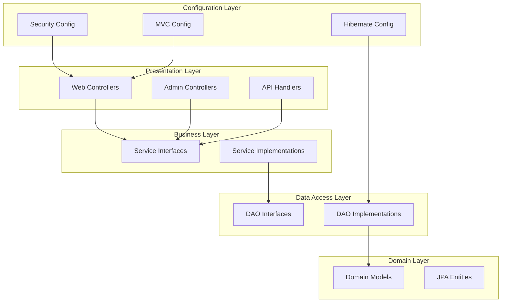
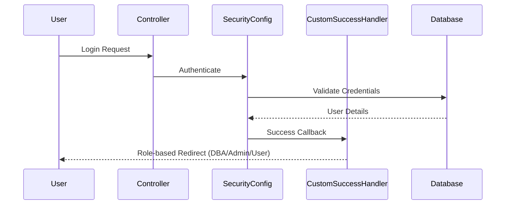
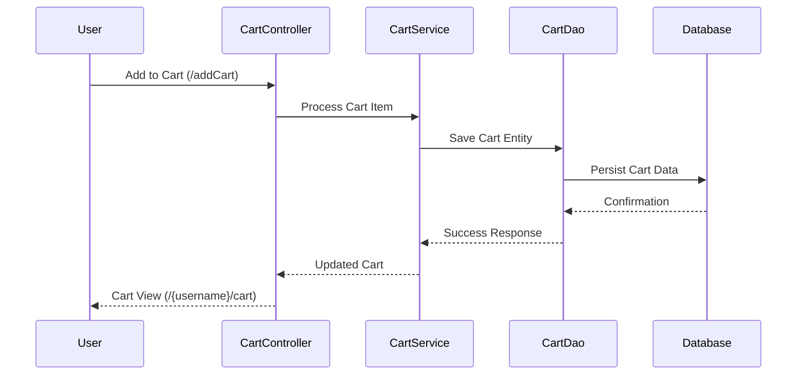
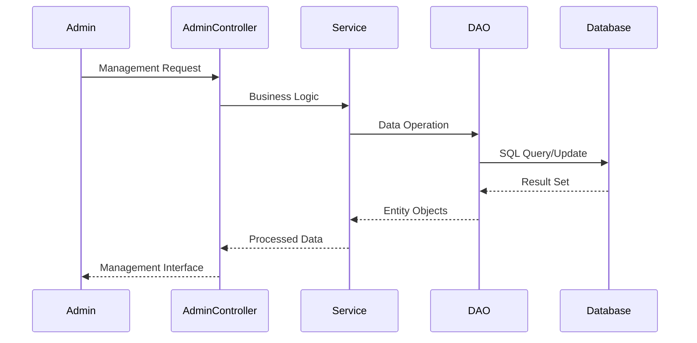
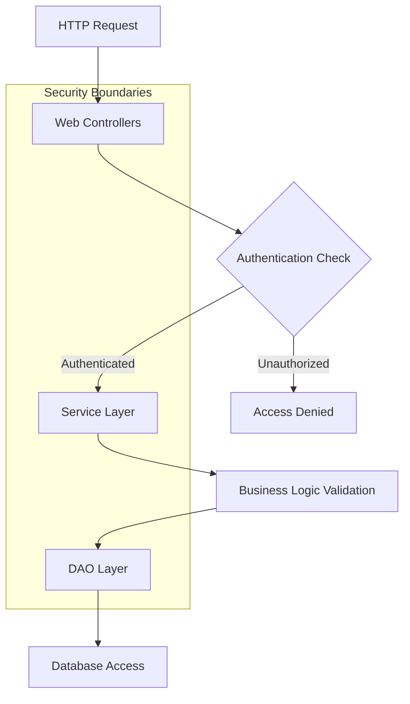
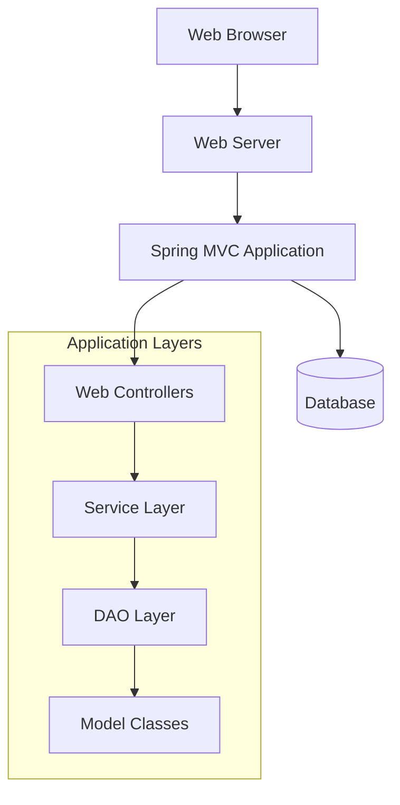

# architecture

## Repository Overview
The ECommerce repository is a comprehensive Spring MVC web application that implements a full-featured e-commerce platform. Built using enterprise Java technologies, this application provides both customer-facing shopping functionality and administrative management capabilities.

### Purpose

This application serves as a complete e-commerce solution offering:

- **Customer Experience**: Product browsing, shopping cart management, wishlist functionality, user account management, and order processing
- **Administrative Management**: Product catalog management, category administration, supplier management, and user administration
- **Security & Authentication**: Role-based access control with separate user and admin interfaces

### Technology Stack

- **Spring MVC**: Web application framework providing the controller layer
- **Spring Security**: Authentication and authorization management
- **Spring Web Flow**: Complex workflow management
- **Hibernate ORM**: Object-relational mapping for data persistence

### Scope

The repository encompasses a complete e-commerce platform with over 30 REST endpoints covering:

- User registration, authentication, and profile management
- Product catalog with category-based organization
- Shopping cart and wishlist functionality
- Order processing and management
- Administrative interfaces for content and user management
- Supplier and inventory management capabilities

The application follows enterprise Java patterns and provides a scalable foundation for e-commerce operations with clear separation between customer and administrative functions.

## Architecture Overview
The ECommerce application follows a traditional **Spring MVC layered architecture** with clear separation of concerns

### Design Philosophy

The system is built on proven enterprise Java patterns:
- **Layered Architecture**: Clear separation between presentation, business, and data access layers
- **Interface-Implementation Pattern**: All services and DAOs define contracts through interfaces
- **MVC Pattern**: Web layer follows Model-View-Controller paradigm
- **Dependency Injection**: Spring framework manages component dependencies

### Core Architecture Layers



### Component Architecture

#### Web Layer
- **HelloWorldController**: Main application controller handling home page
- **Admin Controllers**: Specialized controllers for administrative functions
  - `AdminCategoryController`: Category management operations
  - `AdminProductController`: Product management operations
  - `AdminUserController`: User management operations
  - `AdminSupplierController`: Supplier management operations
- **User Controllers**: Customer-facing functionality
  - `CartController`: Shopping cart operations
  - `ProductController`: Product browsing and search
  - `UserAccountController`: Account management
  - `WishlistController`: Wishlist operations

#### Service Layer
Business logic is encapsulated in service interfaces with concrete implementations:
- **CategoryService/CategoryServiceImpl**: Category business operations
- **ProductService/ProductServiceImpl**: Product business operations
- **UserService/UserServiceImpl**: User account business operations
- **SupplierService/SupplierServiceImpl**: Supplier business operations
- **MailService/MailServiceImpl**: Email notification services

#### Data Access Layer
Data persistence follows the DAO pattern with interface-implementation separation:
- **CategoryDao/CategoryDaoImpl**: Category data operations
- **ProductDao/ProductDaoImpl**: Product data operations
- **UserDao/UserDaoImpl**: User data operations
- **SupplierDao/SupplierDaoImpl**: Supplier data operations
- **CartDao/CartDaoImpl**: Shopping cart data operations

#### Domain Model
Core business entities with JPA/Hibernate mappings:
- **Product**: Product catalog with pricing, categories, and supplier relationships
- **Category**: Product categorization with hierarchical support
- **User**: User accounts with roles and authentication
- **Cart**: Shopping cart with user associations
- **CustomerOrder**: Order processing with payment and shipping details
- **Supplier**: Product supplier information
- **Roles**: User role management
- **ShippingDetails**: Order shipping information

### Configuration Architecture

The application uses Java-based configuration:
- **HelloWorldConfiguration**: Spring MVC setup with view resolvers and mail configuration
- **HibernateConfiguration**: ORM configuration with data source and session factory
- **SecurityConfiguration**: Spring Security setup with authentication and authorization
- **CustomSuccessHandler**: Role-based authentication success handling (DBA, Admin, User)
- **WebFlowConfig**: Spring Web Flow configuration for complex page flows
- **SpringMvcInitializer**: Web application initialization
- **SecurityWebApplicationInitializer**: Security filter initialization

### Key Architectural Patterns

1. **Interface Segregation**: All services and DAOs define clear contracts
2. **Dependency Inversion**: High-level modules depend on abstractions
3. **Single Responsibility**: Each component has a focused purpose
4. **Role-Based Access Control**: Security integrated at the architectural level
5. **Transaction Management**: Declarative transaction handling through Spring

## High-Level Design
### System Boundaries



### Core Subsystems

#### 1. User-Facing Subsystem
- **Components**: `HelloWorldController`, `ProductController`, `CartController`, `WishlistController`, `UserAccountController`
- **Responsibilities**: Handle customer interactions, product browsing, cart management, and user account operations
- **Boundaries**: Serves public endpoints and authenticated user operations

#### 2. Administrative Subsystem
- **Components**: `AdminCategoryController`, `AdminProductController`, `AdminSupplierController`, `AdminUserController`
- **Responsibilities**: Manage categories, products, suppliers, and users through admin dashboard
- **Boundaries**: Restricted to admin role with specialized management interfaces

#### 3. Security Subsystem
- **Components**: `SecurityConfiguration`, `CustomSuccessHandler`, `SecurityWebApplicationInitializer`
- **Responsibilities**: Authentication, authorization, and role-based access control
- **Boundaries**: Cross-cutting concern protecting all application endpoints

#### 4. Data Management Subsystem
- **Components**: Service layer (`CategoryService`, `ProductService`, `UserService`, etc.) and DAO layer (`CategoryDao`, `ProductDao`, `UserDao`, etc.)
- **Responsibilities**: Business logic processing and data persistence operations
- **Boundaries**: Encapsulates all database interactions and business rules

### Architectural Layering

#### Layer 1: Presentation (Controllers)
- Handles HTTP requests and responses
- Route mapping and request validation
- View rendering and model binding

#### Layer 2: Business Logic (Services)
- Implements core business rules
- Transaction management
- Cross-cutting concerns like validation and security

#### Layer 3: Data Access (DAOs)
- Database operations and queries
- Entity mapping and persistence
- Data consistency and integrity

#### Layer 4: Domain Models
- Core business entities (`User`, `Product`, `Cart`, `Category`, `CustomerOrder`)
- Relationship definitions and constraints
- Data structure representation

### Integration Points

- **Spring MVC Integration**: Controllers integrate with view resolvers and model binding
- **Hibernate Integration**: DAO implementations use Hibernate for ORM operations
- **Security Integration**: All layers protected by Spring Security configuration
- **Mail Service Integration**: Notification system integrated across user operations

## Component Design
### Core Components

The ECommerce application follows a layered architecture with distinct component responsibilities:

#### Web Layer Components

**Controllers**
- `HelloWorldController`: Main application controller handling home page requests
- `CartController`: Manages shopping cart operations (add, remove, view)
- `ProductController`: Handles product display, search, and description pages
- `UserAccountController`: Manages user account details and updates
- `WishlistController`: Handles wishlist operations (add, remove, view)

**Admin Controllers**
- `AdminController`: Base admin controller class (package-private)
- `AdminCategoryController`: Category management CRUD operations
- `AdminProductController`: Product management operations
- `AdminSupplierController`: Supplier management operations
- `AdminUserController`: User management operations

#### Service Layer Components

**Service Interfaces and Implementations**
- `CategoryService` / `CategoryServiceImpl`: Category business logic
- `ProductService` / `ProductServiceImpl`: Product business logic
- `SupplierService` / `SupplierServiceImpl`: Supplier business logic
- `UserService` / `UserServiceImpl`: User business logic
- `MailService` / `MailServiceImpl`: Email functionality

#### Data Access Layer Components

**DAO Interfaces and Implementations**
- `CategoryDao` / `CategoryDaoImpl`: Category data access operations
- `ProductDao` / `ProductDaoImpl`: Product data access operations
- `SupplierDao` / `SupplierDaoImpl`: Supplier data access operations
- `UserDao` / `UserDaoImpl`: User data access operations
- `CartDao` / `CartDaoImpl`: Shopping cart data access operations

#### Model Components

**Domain Entities**
- `User`: User entity with email, mobile, role, active status
- `Product`: Product entity with price, image, description, discount
- `Category`: Product category entity with name and description
- `Cart`: Shopping cart entity with quantity, total, user, and status
- `CustomerOrder`: Order entity with payment mode, grand total, status
- `Supplier`: Supplier entity for product sourcing
- `Roles`: User role definitions
- `ShippingDetails`: Shipping information model

#### Configuration Components

**Spring Configuration Classes**
- `HelloWorldConfiguration`: Spring MVC configuration with flow adapters and view resolvers
- `HibernateConfiguration`: Hibernate ORM configuration with data source and session factory
- `SecurityConfiguration`: Spring Security configuration with authentication setup
- `CustomSuccessHandler`: Authentication success handler with role-based redirect logic
- `WebFlowConfig`: Web flow configuration
- `SpringMvcInitializer`: Spring MVC initializer
- `SecurityWebApplicationInitializer`: Security web application initializer

### Component Interactions

#### Request Flow
1. **HTTP Requests** → Controllers receive and route requests
2. **Controllers** → Delegate business logic to service layer
3. **Services** → Use DAO layer for data persistence operations
4. **DAOs** → Interact with database through Hibernate ORM

#### Key Relationships
- Controllers depend on service interfaces for business logic
- Service implementations use DAO interfaces for data access
- All DAO implementations follow the interface-implementation pattern
- Domain entities have established relationships (User→Cart, Product→Category, Product→Supplier)

#### Security Integration
- `SecurityConfiguration` integrates with `CustomSuccessHandler` for role-based authentication
- Role-based access control differentiates between DBA, Admin, and User roles

### Component Dependencies

**Configuration Dependencies**
- `HelloWorldConfiguration` depends on `WebFlowConfig` for web flow setup
- `SecurityConfiguration` uses `CustomSuccessHandler` for authentication flow

**Service Layer Dependencies**
- All service implementations depend on their corresponding DAO interfaces
- Controllers depend on service interfaces, not implementations

**Data Layer Dependencies**
- DAO implementations use Hibernate session factory from `HibernateConfiguration`
- Entity relationships managed through JPA annotations and Hibernate ORM

## Runtime Design
### Request Lifecycle

The ECommerce application follows a standard Spring MVC request processing lifecycle:

1. **HTTP Request Reception**: Incoming requests are received by the Spring DispatcherServlet
2. **Controller Routing**: Requests are routed to appropriate controllers based on URL patterns
3. **Service Layer Delegation**: Controllers delegate business logic to service layer implementations
4. **Data Access**: Services utilize DAO implementations for database operations
5. **Response Generation**: Controllers return view names or data for response rendering

### Execution Flow Patterns

#### Standard CRUD Operations

```
HTTP Request → Controller → Service → DAO → Database
                    ↓
              View/Response ← Model ← Entity
```

#### Authentication Flow

```
Login Request → SecurityConfiguration → CustomSuccessHandler → Dashboard/Home
```

#### Admin Operations

```
Admin Request → Admin Controller → Service Layer → DAO Layer → Database
                     ↓
              Admin Dashboard ← Management Views
```

### Key Execution Flows

**User Registration/Login**:
- GET `/login` → Login page rendering
- GET `/register` → Registration form display
- POST authentication → CustomSuccessHandler → Role-based redirection

**Shopping Cart Operations**:
- GET `/{username}/cart` → CartController → Cart retrieval
- GET `/addCart` → Cart item addition
- GET `/{username}/cart/remove-cart/{cart_id}` → Item removal

**Admin Management**:
- GET `/admin/dashboard` → Admin dashboard rendering
- Category management: GET/POST `/admin/categorys/*`
- Product management: GET/POST `/admin/products/*`
- User management: GET `/admin/users/*`

**Account Management**:
- POST `/updatingAccount-{id}` → updateAccountDetails handler
- POST `/user/{username}/account/edit-details/updatingAccount/{user_id}` → User-specific updates

### Concurrency Considerations

**Session Management**:
- Spring Security handles concurrent user sessions
- User-specific operations (cart, wishlist) are session-scoped

**Database Access**:
- DAO layer implementations handle concurrent database access
- Service layer coordinates transactional boundaries

**State Management**:
- Controllers are stateless, delegating state to service/DAO layers
- User context maintained through Spring Security authentication

### Configuration Dependencies

**Web Flow Integration**:
- HelloWorldConfiguration depends on WebFlowConfig for MVC setup
- SecurityConfiguration integrates with CustomSuccessHandler for authentication flows

**Service Wiring**:
- Controllers depend on service interfaces (CategoryService, ProductService, etc.)
- Services depend on DAO interfaces for data persistence
- Implementation classes provide concrete functionality through interface contracts

## Integration Design
### External Systems and APIs

The ECommerce application exposes a comprehensive REST API for both administrative and user-facing operations. The API follows RESTful conventions and provides endpoints for:

#### Administrative APIs
- **Category Management**: CRUD operations for product categories
  - `GET /admin/categorys/category` - View categories
  - `POST /admin/categorys/add` - Add new category
  - `GET /admin/categorys/edit/{category_id}` - Edit category
  - `GET /admin/categorys/delete/{category_id}` - Delete category

- **Product Management**: Full product lifecycle management
  - `GET /admin/products/product` - View products
  - `POST /admin/products/add` - Add new product
  - `GET /admin/products/edit/{product_id}` - Edit product
  - `GET /admin/products/delete/{product_id}` - Delete product

- **User Management**: Administrative user operations
  - `GET /admin/users/user` - View users
  - `GET /admin/users/changeStatus/{id}` - Change user status
  - `GET /admin/users/delete/{id}` - Delete user

- **Supplier Management**: Supplier relationship management
  - `GET /admin/suppliers/supplier` - View suppliers
  - `POST /admin/suppliers/add` - Add supplier
  - `GET /admin/suppliers/edit/{supplier_id}` - Edit supplier
  - `GET /admin/suppliers/delete/{supplier_id}` - Delete supplier

#### User-Facing APIs
- **Authentication & Registration**:
  - `GET /login` - Login page
  - `GET /register` - User registration
  - `GET /logout` - User logout

- **Shopping Cart Operations**:
  - `GET /{username}/cart` - View user cart
  - `GET /addCart` - Add items to cart
  - `GET /{username}/cart/remove-cart/{cart_id}` - Remove from cart

- **Wishlist Management**:
  - `GET /user/{username}/wishlist` - View wishlist
  - `GET /user/addWishlistItem` - Add to wishlist
  - `GET /user/{username}/wishlist/remove-wishlist/{wishlist_id}` - Remove from wishlist

- **Account Management**:
  - `GET /user/{username}/account` - View account
  - `GET /user/{username}/account/edit-details/{user_id}` - Edit account
  - `POST /user/{username}/account/edit-details/updatingAccount/{user_id}` - Update account

#### Product Discovery APIs
- `GET /displayProduct/productsList` - Browse all products
- `GET /displayProduct/productList/categorywise/{category_id}` - Filter by category
- `GET /SearchController` - Product search functionality
- `GET /descriptionPage` - Product details

### Integration Patterns

#### Service Layer Integration
The application uses a layered service architecture where:
- Controllers handle HTTP requests and delegate to service layer
- Service implementations (`CategoryServiceImpl`, `ProductServiceImpl`, `UserServiceImpl`) provide business logic
- DAO implementations handle data persistence

#### Mail Service Integration
The system includes a `MailService` interface with implementation (`MailServiceImpl`) for:
- User registration confirmations
- Order notifications
- Account updates

#### Security Integration
Security is handled through:
- `SecurityConfiguration` with custom success handlers
- `CustomSuccessHandler` for post-authentication routing
- Role-based access control for admin vs user endpoints

### Data Integration

The application integrates data through well-defined entity relationships:
- Products belong to Categories and are supplied by Suppliers
- Carts and Wishlists belong to Users
- All entities are managed through corresponding DAO interfaces

### Configuration Integration

The system uses Spring configuration classes:
- `HelloWorldConfiguration` for MVC setup
- `WebFlowConfig` for web flow management
- `SecurityConfiguration` for authentication and authorization

## Data Flow Design
The ECommerce application follows a structured data flow pattern through its layered architecture, with clear separation between presentation, business logic, and data access layers.

### User Authentication Flow



### Product Management Data Flow

1. **Admin Product Operations**:
   - Admin accesses dashboard via `/admin/dashboard`
   - AdminProductController handles CRUD operations
   - ProductServiceImpl processes business logic
   - ProductDaoImpl executes database operations
   - Product entities are persisted via Hibernate

2. **User Product Browsing**:
   - ProductController serves product display pages
   - Service layer retrieves product data with category and supplier relationships
   - Products are filtered and presented to users

### Shopping Cart Data Flow



### User Account Management Flow

1. **Registration Process**:
   - User submits registration via `/register`
   - UserAccountController validates input
   - UserServiceImpl processes business rules
   - UserDaoImpl creates user entity
   - User relationships (cart, wishlist) are initialized

2. **Account Updates**:
   - User edits details via account interface
   - updateAccountDetails handler processes POST requests
   - Changes are validated and persisted through service/DAO layers

### Admin Management Data Flow



### Wishlist Operations Flow

1. **Add to Wishlist**:
   - User triggers `/user/addWishlistItem`
   - WishlistController processes request
   - User-wishlist relationship is established
   - Wishlist entity is persisted

2. **View Wishlist**:
   - User accesses `/user/{username}/wishlist`
   - Controller retrieves user-specific wishlist items
   - Items are displayed with removal options

### Configuration and Security Flow

1. **Application Initialization**:
   - SpringMvcInitializer bootstraps MVC configuration
   - SecurityWebApplicationInitializer sets up security
   - HibernateConfiguration establishes database connectivity
   - HelloWorldConfiguration configures view resolvers and mail services

2. **Request Processing**:
   - SecurityConfiguration intercepts requests
   - Authentication is validated
   - CustomSuccessHandler routes based on user roles
   - Controllers process business logic
   - Views are rendered and returned to users

## Security Architecture
### Security Layer Integration

The application implements security through its layered MVC architecture:



### Security Components

**Controller Security**
- **Admin Controllers**: Handle administrative functions with elevated privileges
- **User Controllers**: Manage user-facing operations with standard permissions
- **Service Injection**: Controllers depend on `userService` for authentication and authorization

**Service Layer Security**
- Acts as primary security enforcement point
- Validates user permissions before executing business operations
- Manages session state and user context
- Required services: `userService`, `productService`, `categoryService`

**Data Layer Security**
- **Serializable Entities**: All domain models (User, Product, Cart) implement Serializable for secure data handling
- **DAO Pattern**: Provides controlled database access with query validation
- **Entity Integrity**: Ensures data consistency through proper model design

### Security Patterns

**Interface-Implementation Pattern**
- Security interfaces define contracts for authentication and authorization
- Implementations can be swapped for different security providers

**Service Layer Pattern**
- Centralizes security logic in dedicated service components
- Prevents security bypass through direct DAO access

**MVC Security Integration**
- Controllers handle authentication at request entry point
- Models ensure data integrity through serialization
- Views implement role-based content rendering

## Deployment Architecture
The ECommerce application follows a traditional Spring MVC web application deployment model with a layered architecture that can be deployed across multiple environments.

### Deployment Topology



### Environment Requirements

### Deployment Layers

| Layer | Component | Deployment Consideration |
|-------|-----------|-------------------------|
| Business Logic | Service Layer | Contains business rules, can be distributed |
| Data Access | DAO Layer | Database connection pooling required |
| Persistence | Model Classes | JPA entities, database schema dependent |

### Configuration Dependencies

The deployment architecture relies on proper configuration of:
- Spring Framework context
- Hibernate ORM mappings
- Spring Security policies
- Spring Web Flow definitions

## Dependency Analysis
### Internal Dependencies

#### Framework Dependencies

**Spring Framework Stack**
- **Spring MVC**: Core web framework providing controller layer and request handling
- **Spring Security**: Authentication and authorization framework with role-based access control
- **Spring Web Flow**: Workflow management for complex user interactions
- **Hibernate ORM**: Object-relational mapping for database operations

#### Architectural Layer Dependencies

**Controller → Service Layer**
- Controllers depend on service interfaces for business logic execution
- Examples: `CartController` → `CartService`, `ProductController` → `ProductService`
- **Rationale**: Separation of concerns, enabling testability and maintainability

**Service → DAO Layer**
- Service implementations depend on DAO interfaces for data persistence
- Examples: `CategoryServiceImpl` → `CategoryDao`, `UserServiceImpl` → `UserDao`
- **Rationale**: Abstraction of data access logic, supporting multiple persistence strategies

**DAO → Model Entities**
- DAO implementations operate on domain model classes
- Examples: `CartDaoImpl` → `Cart`, `ProductDaoImpl` → `Product`
- **Rationale**: Type-safe data operations with clear domain boundaries

#### Configuration Dependencies

**Security Configuration Chain**
- `SecurityConfiguration` → `CustomSuccessHandler` for authentication flow
- `SecurityWebApplicationInitializer` → `SecurityConfiguration`
- **Rationale**: Centralized security configuration with custom authentication handling

**MVC Configuration Chain**
- `HelloWorldConfiguration` → `WebFlowConfig` for flow management
- `SpringMvcInitializer` → `HelloWorldConfiguration`
- **Rationale**: Modular configuration supporting complex user workflows

### External Dependencies

#### Database Dependencies
- **Hibernate ORM**: Database abstraction and object mapping
- **Database Driver**: JDBC driver for target database system
- **Rationale**: Standardized data access with database vendor independence

#### Mail Service Dependencies
- **Mail Service Implementation**: External SMTP server integration
- **JavaMail API**: Standard email functionality
- **Rationale**: User communication capabilities for notifications and confirmations

#### Web Container Dependencies
- **Servlet Container**: Application server for web application hosting
- **JSP/JSTL**: View layer rendering technology
- **Rationale**: Standard Java EE deployment model with mature tooling support

### Dependency Management Strategy

#### Interface-Based Design
- All service and DAO components use interface-implementation pattern
- Enables dependency injection and testing with mock implementations
- **Benefits**: Loose coupling, enhanced testability, flexible implementation swapping

#### Layered Dependency Flow

```
Controllers → Services → DAOs → Models
     ↓           ↓        ↓
Views    Business  Data   Domain
         Logic    Access  Objects
```

#### Configuration Isolation
- Separate configuration classes for different concerns (Security, MVC, Hibernate)
- **Benefits**: Modular configuration, easier maintenance, clear separation of responsibilities

## APIs and Interfaces
The ECommerce application exposes a comprehensive REST API through Spring MVC controllers, organized into distinct functional areas with clear separation between public user interfaces and administrative functions.

### API Architecture

The API layer follows a layered architecture pattern:
- **Controllers**: Handle HTTP requests and responses
- **Services**: Implement business logic
- **DAOs**: Manage data access operations
- **Models**: Define data entities

### Public User APIs

#### Core User Endpoints
- `GET /` - Home page
- `GET /login` - User authentication
- `GET /register` - User registration
- `GET /account` - User account management

#### Shopping Cart APIs
- `GET /addCart` - Add items to cart
- `GET /{username}/cart` - View user's cart
- `GET /{username}/cart/remove-cart/{cart_id}` - Remove cart items

#### Wishlist APIs
- `GET /user/addWishlistItem` - Add items to wishlist
- `GET /user/{username}/wishlist` - View user's wishlist
- `GET /user/{username}/wishlist/remove-wishlist/{wishlist_id}` - Remove wishlist items

#### Product APIs
- Product display and search functionality
- Product description pages
- Category-based product filtering

#### Account Management
- `POST /updatingAccount-{id}` - Update account details
- `POST /user/{username}/account/edit-details/updatingAccount/{user_id}` - Update user account

### Administrative APIs

#### Admin Dashboard
- `GET /admin/dashboard` - Main admin interface
- `GET /gotoadminsection` - Admin section access

#### Category Management
- `GET /admin/categorys/category` - List categories
- `POST /admin/categorys/add` - Add new category
- `GET /admin/categorys/edit/{category_id}` - Edit category
- `GET /admin/categorys/delete/{category_id}` - Delete category

#### Product Management
- `GET /admin/products/product` - List products
- `GET /admin/products/edit/{product_id}` - Edit product
- `GET /admin/products/delete/{product_id}` - Delete product

#### User Management
- `GET /admin/users/user` - List users
- `GET /admin/users/changeStatus/{id}` - Change user status
- `GET /admin/users/delete/{id}` - Delete user

### Security and Authentication

The API implements role-based access control through Spring Security:
- **CustomSuccessHandler**: Manages authentication success with role-based redirects (DBA, Admin, User)
- **SecurityConfiguration**: Defines authentication and authorization rules
- Protected admin endpoints require appropriate administrative privileges

### Interface Contracts

The application defines clear interface contracts through:
- **Service Interfaces**: CategoryService, ProductService, UserService, SupplierService, MailService
- **DAO Interfaces**: CategoryDao, ProductDao, UserDao, SupplierDao, CartDao
- **Model Classes**: User, Product, Category, Cart, CustomerOrder, Supplier, ShippingDetails

Each interface follows consistent patterns for CRUD operations and business logic encapsulation.