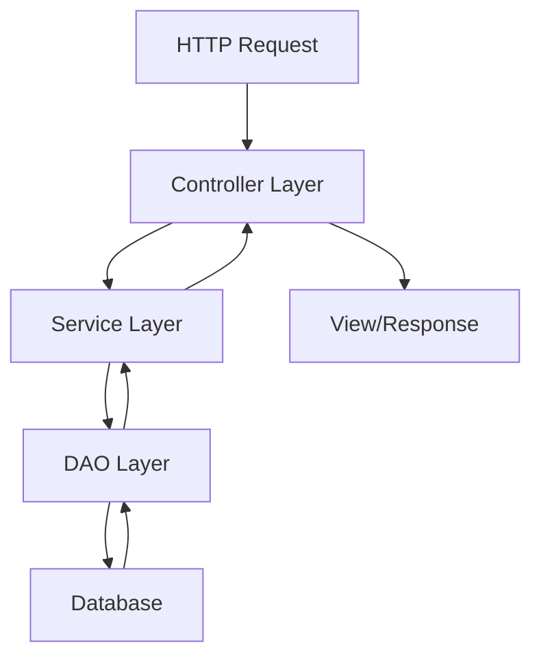

# context

## System Overview
The ECommerce repository is a comprehensive Java-based web application built using the Spring MVC framework. This system provides a complete e-commerce platform with both customer-facing and administrative functionality.

### Purpose

- **Customer Operations**: Product browsing, shopping cart management, wishlist functionality, user account management, and order processing
- **Administrative Management**: Complete backend administration for categories, products, suppliers, and user management
- **Security & Authentication**: Role-based access control with different permission levels for customers, administrators, and database administrators

### Core Functionality

**Customer Features:**
- Product catalog browsing and search
- Shopping cart operations (add, remove, update quantities)
- Wishlist management for saving desired products
- User account registration, login, and profile management
- Order placement and tracking

**Administrative Features:**
- Category management (CRUD operations)
- Product management (inventory, pricing, descriptions)
- Supplier management and relationships
- User management and status control
- Comprehensive dashboard for system oversight

**Technical Capabilities:**
- RESTful API endpoints for all operations
- Secure authentication with custom success handlers
- Email service integration for notifications
- Hibernate ORM for database operations
- Spring Security for authorization and access control

### Architecture Approach

The system follows a layered architecture pattern with clear separation of concerns:

- **Presentation Layer**: Spring MVC controllers handling HTTP requests and responses
- **Business Logic Layer**: Service classes implementing core business rules
- **Data Access Layer**: DAO pattern for database operations
- **Model Layer**: Entity classes representing business objects
- **Configuration Layer**: Spring configuration for security, database, and web flow setup

This architecture ensures maintainability, scalability, and clear separation between different system responsibilities while providing a robust foundation for e-commerce operations.

## Domain Model
their relationships

### Core Domain Entities

#### User Management
- **User**: Central entity managing user authentication, profile information, and associations with cart and wishlist
- **Roles**: Defines user authorization levels (admin, DBA, regular user)
- **ShippingDetails**: Manages delivery address information for orders

#### Product Catalog
- **Product**: Core product entity with properties for name, price, description, image, category association, and discount information
- **Category**: Product categorization entity for organizing the product catalog
- **Supplier**: Manages supplier information for product sourcing

#### Shopping & Orders
- **Cart**: Shopping cart entity linking users to products with quantity and total amount tracking
- **CustomerOrder**: Order management entity handling order details, status, dates, and shipping addresses
- **Wishlist**: User wishlist functionality for saving desired products

### Entity Relationships

The domain model establishes clear relationships between entities:

- **User ↔ Cart**: One-to-one relationship where each user has an associated shopping cart
- **User ↔ Wishlist**: One-to-one relationship for user wishlist management
- **Cart ↔ Product**: Many-to-one relationship linking cart items to specific products
- **Product ↔ Category**: Many-to-one relationship for product categorization
- **User ↔ Roles**: Association for role-based access control

### Domain Responsibilities

#### User Domain
- Authentication and authorization management
- Profile and account information maintenance
- Shopping cart and wishlist ownership

#### Product Domain
- Product catalog management
- Category organization and hierarchy
- Supplier relationship management
- Pricing and discount handling

#### Order Domain
- Shopping cart operations (add, remove, update quantities)
- Order processing and status management
- Shipping details and delivery tracking

### Supporting Infrastructure

The domain model is supported by a layered architecture:

- **Service Layer**: Business logic implementation for each domain area
- **Data Access Layer**: DAO pattern implementation for entity persistence
- **Controller Layer**: Web interface for domain operations (both user-facing and administrative)
- **Configuration Layer**: Security, database, and application configuration management

## API Inventory
The ECommerce application exposes a comprehensive REST API with endpoints organized by functional areas:

### Public Endpoints

| Method | Path | Purpose |
|--------|------|----------|
| GET | `/` | Main home page |
| GET | `/aboutUs` | About us information page |
| GET | `/login` | User login page |
| GET | `/logout` | User logout handler |
| GET | `/register` | User registration handler |
| GET | `/Registration` | User registration page |
| GET | `/Access_Denied` | Access denied page |
| GET | `/SearchController` | Product search functionality |

### User Account Management

| Method | Path | Purpose |
|--------|------|----------|
| GET | `/account` | User account overview |
| GET | `/user/{username}/account` | User-specific account details |
| GET | `/user/{username}/account/edit-details/{user_id}` | Account editing form |
| POST | `/updatingAccount-{id}` | Update account details |
| POST | `/user/{username}/account/edit-details/updatingAccount/{user_id}` | Update user-specific account |

### Shopping Cart Operations

| Method | Path | Purpose |
|--------|------|----------|
| GET | `/addCart` | Add item to cart |
| GET | `/{username}/cart` | View user's shopping cart |

### Wishlist Management

| Method | Path | Purpose |
|--------|------|----------|
| GET | `/user/addWishlistItem` | Add item to wishlist |
| GET | `/user/{username}/wishlist` | View user's wishlist |
| GET | `/user/{username}/wishlist/remove-wishlist/{wishlist_id}` | Remove item from wishlist |

### Administrative Endpoints

#### Dashboard

| Method | Path | Purpose |
|--------|------|----------|
| GET | `/admin/dashboard` | Admin dashboard interface |

#### Category Management

| Method | Path | Purpose |
|--------|------|----------|
| GET | `/admin/categorys/category` | View all categories |
| POST | `/admin/categorys/add` | Create new category |
| GET | `/admin/categorys/edit/{category_id}` | Edit category form |
| GET | `/admin/categorys/delete/{category_id}` | Delete category |

#### Product Management

| Method | Path | Purpose |
|--------|------|----------|
| GET | `/admin/products/product` | View all products |
| GET | `/admin/products/edit/{product_id}` | Edit product form |
| GET | `/admin/products/delete/{product_id}` | Delete product |

#### Supplier Management

| Method | Path | Purpose |
|--------|------|----------|
| GET | `/admin/suppliers/supplier` | View all suppliers |
| GET | `/admin/suppliers/edit/{supplier_id}` | Edit supplier form |
| GET | `/admin/suppliers/delete/{supplier_id}` | Delete supplier |

#### User Management

| Method | Path | Purpose |
|--------|------|----------|
| GET | `/admin/users/user` | View all users |
| GET | `/admin/users/changeStatus/{id}` | Change user account status |
| GET | `/admin/users/delete/{id}` | Delete user account |

### API Controllers

The application implements several controller classes to handle these endpoints:

- **HelloWorldController**: Handles public pages and basic navigation
- **UserAccountController**: Manages user account operations and profile management
- **CartController**: Handles shopping cart functionality
- **ProductController**: Manages product display and search operations
- **AdminCategoryController**: Administrative category management
- **AdminProductController**: Administrative product management
- **AdminSupplierController**: Administrative supplier management
- **AdminUserController**: Administrative user management

All endpoints follow RESTful conventions with appropriate HTTP methods and return either view names for page rendering or redirect responses for action handlers.

## Data Flows
The ECommerce application follows several key data flow patterns for request processing and business operations:

### Request Processing Flow



### Authentication Flow

1. **Login Process**
   - User accesses `/login` endpoint
   - Credentials processed by SecurityConfiguration
   - CustomSuccessHandler manages successful authentication
   - User redirected to appropriate dashboard based on role

2. **Registration Flow**
   - New users access `/register` endpoint
   - User data validated and processed
   - Account created through UserService and UserDao
   - User redirected to login page

### Shopping Cart Operations

1. **Add to Cart Flow**
   - User triggers `/addCart` endpoint
   - CartController processes the request
   - Cart entity associates User and Product
   - Cart data persisted via CartDao

2. **View Cart Flow**
   - User accesses `/{username}/cart`
   - CartController retrieves user's cart items
   - Cart data displayed with associated products

### Admin Management Flows

1. **Product Management**
   - Admin accesses `/admin/products/product`
   - ProductController delegates to ProductService
   - ProductService uses ProductDao for data operations
   - Product entities linked to Category entities

2. **User Management**
   - Admin accesses `/admin/users/user`
   - User status changes via `/admin/users/changeStatus/{id}`
   - UserService handles business logic
   - UserDao manages persistence

### Account Management Flow

1. **Account Updates**
   - User accesses `/user/{username}/account/edit-details/{user_id}`
   - POST to `/updatingAccount-{id}` or `/user/{username}/account/edit-details/updatingAccount/{user_id}`
   - Both routes delegate to `updateAccountDetails` handler
   - Account changes persisted through UserService

### Wishlist Operations

1. **Wishlist Management**
   - Users access `/user/{username}/wishlist`
   - Items added via `/user/addWishlistItem`
   - Wishlist entities associated with User accounts
   - Data managed through appropriate service and DAO layers

All data flows follow the consistent pattern of Controller → Service → DAO → Database, ensuring separation of concerns and maintainable architecture.

## External Integrations
The ECommerce application integrates with several external systems and services to provide comprehensive functionality:

### Database Integration

The application uses a layered data access architecture with dedicated DAO (Data Access Object) implementations:

- **CartDaoImpl** - Handles shopping cart persistence operations
- **CategoryDaoImpl** - Manages product category data access
- **ProductDaoImpl** - Handles product information storage and retrieval
- **SupplierDaoImpl** - Manages supplier data operations
- **UserDaoImpl** - Handles user account and authentication data

Each DAO implementation follows the interface pattern, providing abstraction between the business logic and data persistence layers.

### Email Services

The system includes email functionality through the **MailService** interface and its implementation **MailServiceImpl**. This service handles:

- User registration confirmations
- Password reset notifications
- Order confirmations and updates
- Administrative notifications

### Authentication Integration

The application integrates with Spring Security for authentication and authorization:

- **SecurityConfiguration** - Configures security policies and access controls
- **CustomSuccessHandler** - Handles post-authentication routing and session management
- Role-based access control for admin and user functions

### Third-Party Service Architecture

- **CategoryService/CategoryServiceImpl** - Product categorization services
- **ProductService/ProductServiceImpl** - Product management and search capabilities
- **SupplierService/SupplierServiceImpl** - Supplier relationship management
- **UserService/UserServiceImpl** - User account and profile management

and shipping providers through the established service interface pattern.

## User Journeys
### Customer Journey

#### New Customer Registration and Shopping
1. **Landing** - Customer visits home page (`GET /`)
2. **Registration** - Customer creates account (`GET /Registration`, `GET /register`)
3. **Product Discovery** - Customer browses products and searches (`GET /SearchController`)
4. **Shopping Cart** - Customer adds items to cart (`GET /addCart`, `GET /{username}/cart`)
5. **Wishlist Management** - Customer saves items for later (`GET /user/addWishlistItem`, `GET /user/{username}/wishlist`)
6. **Account Management** - Customer manages profile (`GET /user/{username}/account`, `POST /user/{username}/account/edit-details/updatingAccount/{user_id}`)

#### Returning Customer Journey
1. **Authentication** - Customer logs in (`GET /login`)
2. **Account Access** - Customer views account details (`GET /account`, `GET /user/{username}/account`)
3. **Cart Management** - Customer manages existing cart items (`GET /{username}/cart`)
4. **Wishlist Review** - Customer reviews saved items (`GET /user/{username}/wishlist`, `GET /user/{username}/wishlist/remove-wishlist/{wishlist_id}`)

### Administrator Journey

#### Daily Administrative Tasks
1. **Dashboard Access** - Admin logs in and accesses dashboard (`GET /admin/dashboard`)
2. **Category Management** - Admin manages product categories:
   - View categories (`GET /admin/categorys/category`)
   - Add new category (`POST /admin/categorys/add`)
   - Edit category (`GET /admin/categorys/edit/{category_id}`)
   - Delete category (`GET /admin/categorys/delete/{category_id}`)
3. **Product Management** - Admin manages product catalog:
   - View products (`GET /admin/products/product`)
   - Edit product (`GET /admin/products/edit/{product_id}`)
   - Delete product (`GET /admin/products/delete/{product_id}`)
4. **User Management** - Admin manages user accounts:
   - View users (`GET /admin/users/user`)
   - Change user status (`GET /admin/users/changeStatus/{id}`)
   - Delete user (`GET /admin/users/delete/{id}`)
5. **Supplier Management** - Admin manages suppliers:
   - View suppliers (`GET /admin/suppliers/supplier`)
   - Edit supplier (`GET /admin/suppliers/edit/{supplier_id}`)
   - Delete supplier (`GET /admin/suppliers/delete/{supplier_id}`)

### Developer Journey

#### Setting Up Development Environment
1. **Configuration Setup** - Developer configures Spring components:
   - Database configuration via `HibernateConfiguration`
   - Security setup via `SecurityConfiguration`
   - Web flow configuration via `HelloWorldConfiguration`
2. **Controller Development** - Developer implements business logic:
   - User-facing controllers (`CartController`, `ProductController`, `UserAccountController`)
   - Admin controllers (`AdminCategoryController`, `AdminProductController`, `AdminUserController`)
3. **Service Layer Implementation** - Developer creates business services:
   - Product services (`ProductService`, `ProductServiceImpl`)
   - User services (`UserService`, `UserServiceImpl`)
   - Category services (`CategoryService`, `CategoryServiceImpl`)
4. **Data Access Layer** - Developer implements data persistence:
   - DAO interfaces (`ProductDao`, `UserDao`, `CategoryDao`)
   - DAO implementations (`ProductDaoImpl`, `UserDaoImpl`, `CategoryDaoImpl`)

#### Authentication Flow
The `CustomSuccessHandler` manages role-based redirection after successful authentication, directing users to appropriate interfaces based on their roles (admin, DBA, or regular user).

## Deployment Notes
### Runtime Architecture

The ECommerce application follows a traditional Spring MVC deployment model with the following runtime characteristics:

**Application Tier**
- Spring MVC web application deployed as a WAR file
- Embedded or external servlet container (Tomcat/Jetty)
- Service layer components managed by Spring IoC container
- Dependency injection configured through Spring configuration

**Data Tier**
- DAO layer provides abstraction over data persistence
- Database connectivity through JDBC or ORM framework
- Connection pooling for database resource management

**Request Flow Topology**

```
HTTP Request → Web Controller → Service Layer → DAO Layer → Database
                     ↓
              View Resolution → HTTP Response
```

**Deployment Considerations**
- Controllers handle both admin and user-facing endpoints
- Layered architecture supports horizontal scaling at service tier
- DAO pattern enables database abstraction and testing
- MVC separation allows independent scaling of presentation and business logic

**Configuration Requirements**
- Spring application context configuration
- Database connection configuration
- Web.xml servlet mapping configuration
- Service and DAO bean definitions
